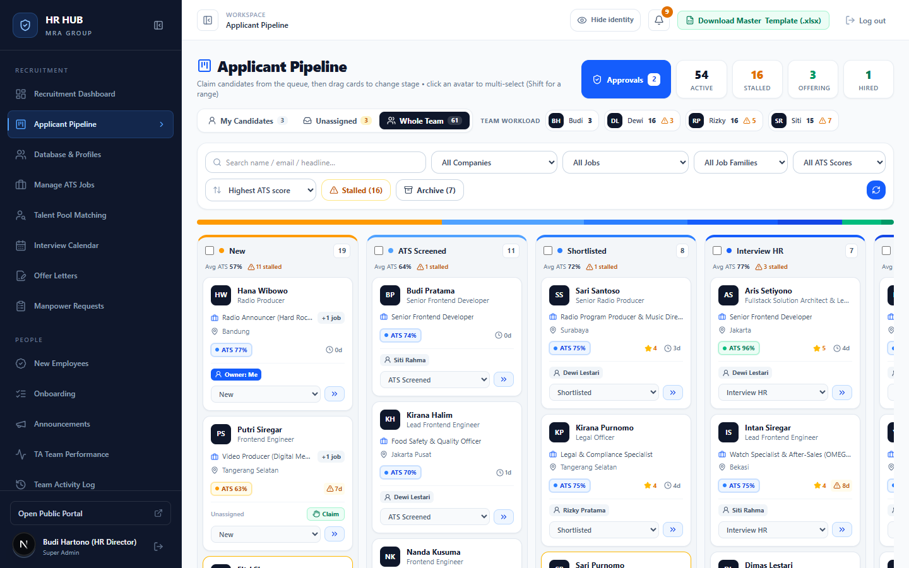
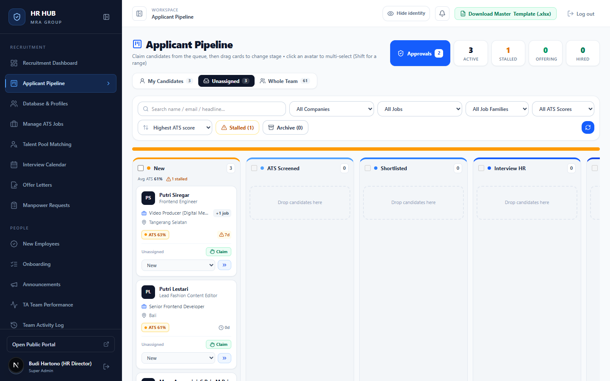
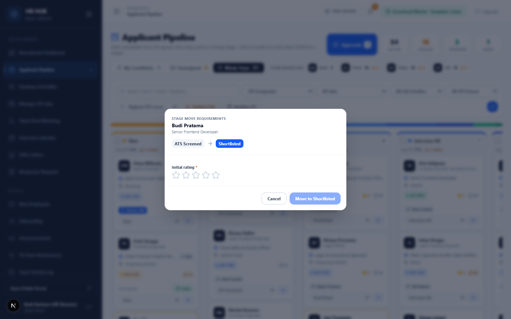
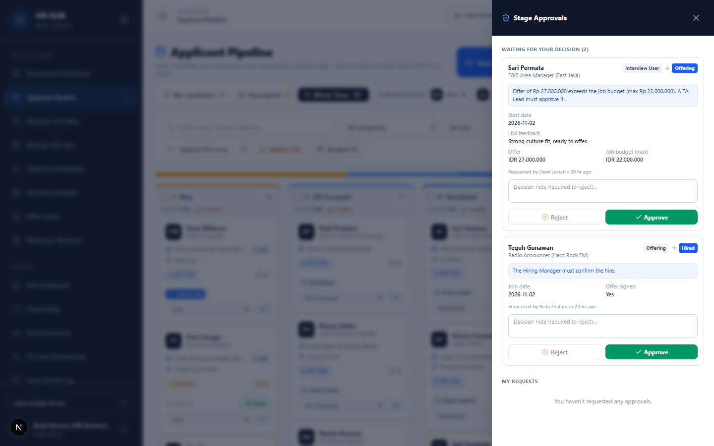
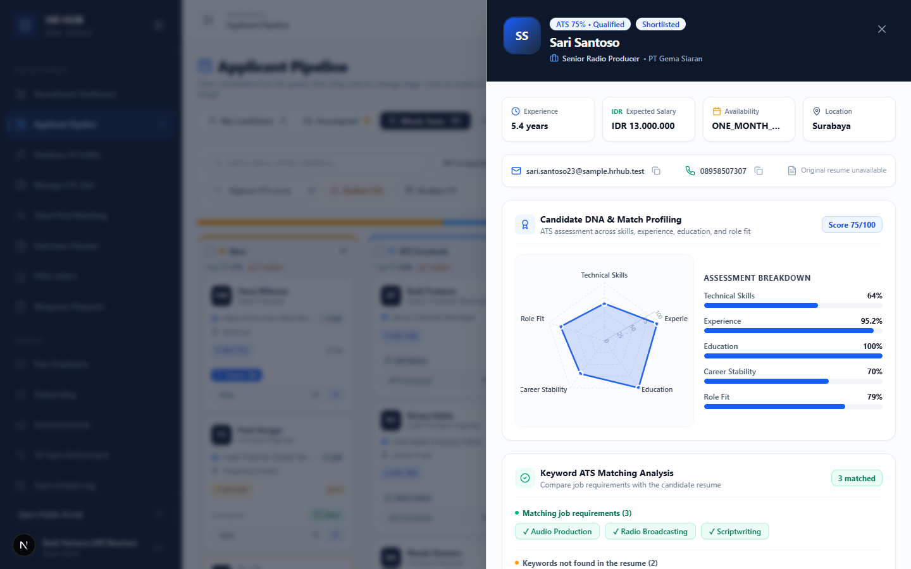
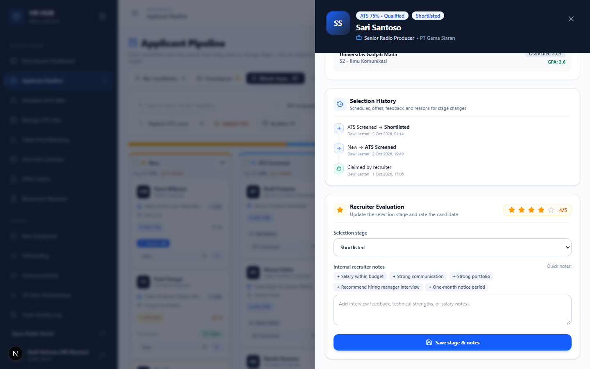

# Panduan Applicant Pipeline

**HR HUB · MRA Group** — untuk Recruiter (TA), TA Lead, HR Director, dan Hiring Manager

Applicant Pipeline adalah papan kerja harian tim Talent Acquisition. Setiap kartu adalah satu lamaran (satu kandidat untuk satu lowongan). Kartu bergerak dari kiri ke kanan mengikuti tahap seleksi, dan setiap kartu punya satu **PIC** (Recruiter penanggung jawab).

Menu: **Recruitment → Applicant Pipeline** (`/admin/pipeline`)

---

## Daftar isi

1. [Mengenal papan](#1-mengenal-papan)
2. [Siapa melakukan apa](#2-siapa-melakukan-apa)
3. [Mengambil kandidat dari antrean (Claim)](#3-mengambil-kandidat-dari-antrean-claim)
4. [Memindahkan tahap](#4-memindahkan-tahap)
5. [Syarat setiap tahap (stage gate)](#5-syarat-setiap-tahap-stage-gate)
6. [Persetujuan (Approvals)](#6-persetujuan-approvals)
7. [Detail kandidat](#7-detail-kandidat)
8. [Kandidat yang diterima (Hired)](#8-kandidat-yang-diterima-hired)
9. [Tips & pertanyaan umum](#9-tips--pertanyaan-umum)

---

## 1. Mengenal papan

| Bagian | Fungsi |
|---|---|
| **Approvals** | Daftar persetujuan yang menunggu keputusan Anda (angka = jumlahnya). |
| Kartu **Active / Stalled / Offering / Hired** | Ringkasan isi papan sesuai filter saat ini. |
| Tab **My Candidates / Unassigned / Whole Team** | Kandidat milik Anda, antrean tanpa PIC, atau seluruh tim. |
| **Team workload** (TA Lead) | Jumlah kandidat aktif per Recruiter. ⚠ = jumlah yang tertahan. |
| Pencarian & filter | Nama/email, PT, lowongan, kelompok pekerjaan, rentang skor ATS. |
| **Highest ATS score** | Urutan kartu dalam kolom. |
| **Stalled (n)** | Hanya kandidat yang tidak bergerak ≥7 hari. |
| **Archive (n)** | Menampilkan kolom *Rejected* dan *Talent Pool*. |

Kolom tahap: **New → ATS Screened → Shortlisted → Interview HR → Interview User → Offering → Hired**.

Isi setiap kartu:
- Nama, headline, lowongan, dan lokasi kandidat.
- Label **+1 job** jika kandidat juga melamar lowongan lain.
- **Skor ATS** (hijau ≥85, biru 70–84, oranye <70) dan rating bintang.
- **Umur di tahap**. Ikon ⚠ muncul setelah 7 hari dan berubah merah setelah 14 hari.
- PIC kandidat.

Setiap kolom menampilkan 20 kartu, lalu tombol **Show more**.

---

## 2. Siapa melakukan apa

| Aksi | Recruiter (TA) | TA Lead / Super Admin | Hiring Manager |
|---|:-:|:-:|:-:|
| Melihat papan | ✓ | ✓ | hanya lowongannya |
| Mengambil kandidat dari antrean | ✓ | ✓ | – |
| Memindahkan kartu | hanya miliknya | semua | – |
| Menugaskan / melepas PIC | – | ✓ | – |
| Menyetujui gaji di atas budget | – | ✓ | – |
| Mengonfirmasi hire | – | Super Admin | ✓ |

---

## 3. Mengambil kandidat dari antrean (Claim)

Buka tab **Unassigned**. Kartu tanpa PIC menampilkan tombol hijau **Claim**. Setelah diklik, kandidat menjadi milik Anda dan pindah ke tab *My Candidates*.

- Jika dua Recruiter mengklik *Claim* bersamaan, hanya satu yang berhasil. Yang lain mendapat pesan bahwa kandidat sudah diambil.
- Memindahkan kartu yang belum punya PIC otomatis menjadikan Anda PIC-nya.
- TA Lead bisa menugaskan atau melepas PIC siapa saja dari kartu.

---

## 4. Memindahkan tahap

Ada tiga cara:

1. **Seret** kartu ke kolom tujuan.
2. Klik tombol **»** di kartu untuk maju satu tahap.
3. Pilih tahap dari **dropdown** di kartu.

Perpindahan tanpa syarat langsung diterapkan, dan muncul notifikasi dengan tombol **Undo**. Perpindahan yang punya syarat membuka formulir (lihat bagian 5).

**Banyak kartu sekaligus:** klik avatar kandidat untuk memilih. Tahan *Shift* untuk memilih satu rentang, atau centang judul kolom untuk memilih seluruh kolom. Bilah aksi di bawah memungkinkan memindahkan semua kartu terpilih. Perpindahan massal hanya menerapkan perpindahan tanpa syarat. Kartu yang butuh isian dilaporkan sebagai *needs review*, untuk dipindahkan satu per satu.

**Menolak kandidat:** pindahkan ke *Rejected*. Alasan penolakan wajib diisi dan tersimpan di catatan kandidat.

---

## 5. Syarat setiap tahap (stage gate)

Beberapa perpindahan membuka formulir **Stage move requirements**. Isian ini tersimpan di riwayat kandidat dan dipakai lagi oleh menu lain (kalender interview, offer letter, Talenta).

| Ke tahap | Yang harus diisi |
|---|---|
| Tahap mana pun dengan skor ATS < 60 | Alasan tetap dilanjutkan |
| **Shortlisted** | Rating awal (1–5 bintang) |
| **Interview HR** | Jadwal, pewawancara, mode (online/onsite) |
| **Interview User** | Rating HR ≥3, keputusan *Proceed*, jadwal interview user |
| **Offering** | Feedback Hiring Manager, gaji yang ditawarkan, tanggal mulai. **Gaji di atas budget lowongan → perlu persetujuan TA Lead.** |
| **Hired** | Offer sudah ditandatangani, tanggal bergabung. **Perlu konfirmasi Hiring Manager.** |
| **Rejected**, mundur tahap, membuka kembali | Alasan |
| Melompati tahap | Hanya TA Lead, dengan alasan |

---

## 6. Persetujuan (Approvals)

Jika perpindahan butuh persetujuan, kartu menampilkan **Awaiting approval** dan terkunci sampai diputuskan. Klik tombol **Approvals** untuk membuka daftar persetujuan.

- **Waiting for your decision**: permintaan yang bisa Anda putuskan. Klik **Approve**, atau tulis catatan lalu **Reject** (catatan wajib saat menolak).
- **My requests**: permintaan yang Anda ajukan. Anda bisa menariknya kembali selama belum diputuskan.
- Jika pengaju sendiri punya hak menyetujui (misalnya TA Lead mengajukan gaji di atas budget), perpindahan langsung diterapkan.

---

## 7. Detail kandidat

Klik nama di kartu untuk membuka panel detail.

Panel detail berisi:
- Ringkasan pengalaman, ekspektasi gaji, ketersediaan, dan lokasi, plus kontak (bisa disalin).
- Tombol **CV asli**, jika kandidat mengunggah CV.
- **Candidate DNA & Match Profiling**: grafik radar dan rincian skor.
- **Keyword ATS Matching**: kata kunci yang cocok dan yang tidak ditemukan di CV.
- Pengalaman kerja dan pendidikan.

Di bagian bawah:
- **Selection History**: semua perpindahan tahap beserta isiannya (jadwal, gaji, alasan, persetujuan).
- **Recruiter Evaluation**: rating, catatan internal dengan *quick notes*, dan perubahan tahap tanpa syarat.
- **Application History**: semua lamaran orang ini, plus peringatan jika ada profil lain yang kemungkinan orang yang sama (nomor HP atau nama sama).

---

## 8. Kandidat yang diterima (Hired)

Kartu di kolom **Hired** memiliki dua tombol:

- **Register**: mendaftarkan kandidat sebagai karyawan baru (lihat [panduan New Employees](../new-employees/README.md)). Setelah itu kartu hilang dari papan.
- **Release**: mengeluarkan kartu dari papan tanpa didaftarkan. Bisa dikembalikan dari menu New Employees.

Kandidat yang sudah keluar dari papan tetap dihitung sebagai *Hired* di dashboard dan laporan.

---

## 9. Tips & pertanyaan umum

**Saya tidak bisa memindahkan kartu.**
Kartu itu milik Recruiter lain, atau sedang menunggu persetujuan. Minta TA Lead untuk menugaskannya ke Anda.

**Bagaimana menemukan kandidat yang lama tidak diproses?**
Klik **Stalled**, atau buka tautan *16 candidates stalled* di Action Center dashboard.

**Kandidat juga melamar posisi lain. Di mana melihatnya?**
Lihat label **+n job** di kartu, lalu *Application History* di panel detail.

**Apakah Hiring Manager bisa mengubah tahap?**
Tidak. Hiring Manager melihat kandidat lowongannya dan mengonfirmasi hire di **Approvals**.
