# Panduan Melamar Kerja di MRA Group

**HR HUB · MRA Group** — untuk pelamar kerja (calon karyawan)

Panduan ini menjelaskan cara mencari lowongan, melamar, dan memantau status lamaran Anda di portal karier MRA Group. Semua langkah bisa dilakukan sendiri dari komputer maupun HP, tanpa perlu membuat akun.

Alamat: **portal karier MRA Group** (halaman utama) · cek status lamaran di menu **Lacak Status Lamaran**

---

## Daftar isi

1. [Sekilas proses rekrutmen](#1-sekilas-proses-rekrutmen)
2. [Mencari lowongan](#2-mencari-lowongan)
3. [Membaca detail lowongan](#3-membaca-detail-lowongan)
4. [Melamar dengan CV (cara utama)](#4-melamar-dengan-cv-cara-utama)
5. [Melamar dengan template Excel](#5-melamar-dengan-template-excel)
6. [Tips agar CV terbaca dengan baik](#6-tips-agar-cv-terbaca-dengan-baik)
7. [Melacak status lamaran](#7-melacak-status-lamaran)
8. [Setelah lolos seleksi](#8-setelah-lolos-seleksi)
9. [Pertanyaan umum](#9-pertanyaan-umum)

---

## 1. Sekilas proses rekrutmen

```
  Anda melamar ──▶ CV dinilai ──▶ Shortlist ──▶ Interview HR ──▶ Interview User ──▶ Penawaran ──▶ Bergabung
   (portal)        otomatis        oleh tim       (online /        (calon atasan)     kerja
                   oleh sistem     rekrutmen       onsite)                           (offer letter)
```

- Setiap lamaran **dinilai otomatis** oleh sistem: keahlian, pengalaman, dan pendidikan Anda dicocokkan dengan kriteria lowongan.
- Tim rekrutmen kemudian meninjau lamaran dan menghubungi kandidat yang sesuai lewat **email atau WhatsApp** untuk jadwal interview.
- Anda bisa memantau perkembangan lamaran kapan saja dengan email yang dipakai saat melamar.

---

## 2. Mencari lowongan

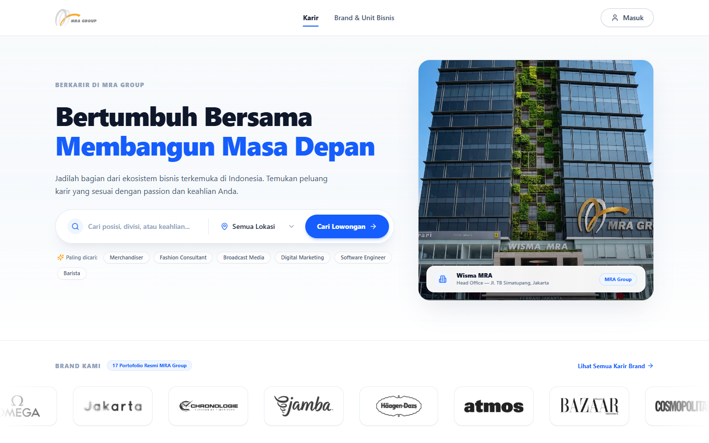

1. Ketik **posisi, divisi, atau keahlian** di kotak pencarian, misalnya *Barista*, *Sales*, atau *Digital Marketing*.
2. Pilih **lokasi kerja** (opsional), lalu klik **Cari Lowongan**.
3. Atau klik salah satu kata kunci **Paling dicari** di bawah kotak pencarian.

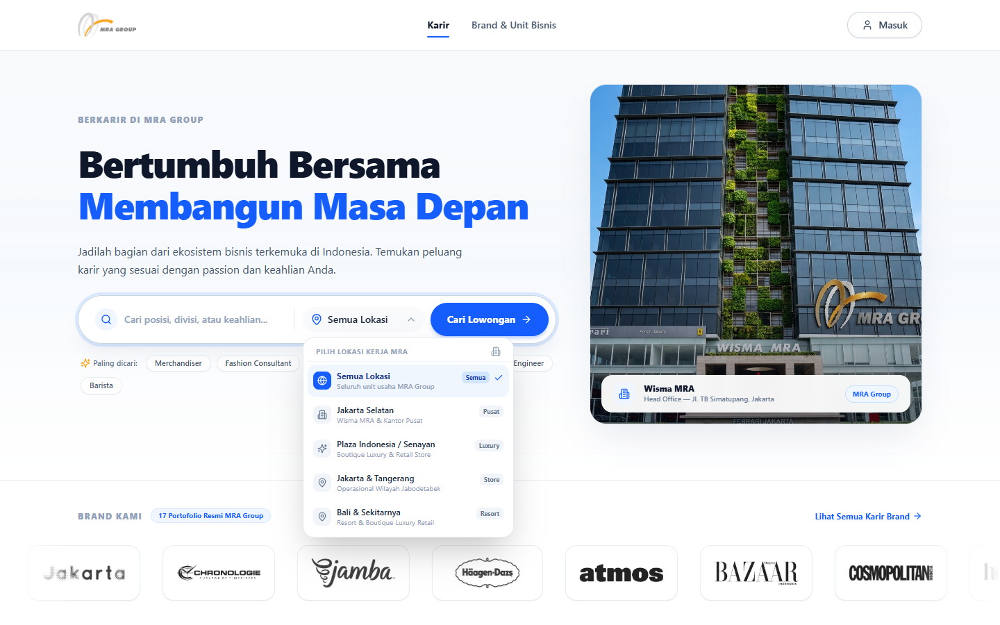

| Lokasi | Keterangan |
|---|---|
| **Semua Lokasi** | Seluruh unit usaha MRA Group |
| **Jakarta Selatan** | Wisma MRA dan kantor pusat |
| **Plaza Indonesia / Senayan** | Butik luxury dan retail store |
| **Jakarta & Tangerang** | Operasional wilayah Jabodetabek |
| **Bali & Sekitarnya** | Resort dan butik luxury retail |

Di bawah bagian *Brand Kami*, lowongan bisa disaring per bidang usaha: **Retail & Fashion**, **Food & Beverage**, **Media & Radio**, dan **Corporate & Technology**. Angka di setiap tab menunjukkan jumlah lowongan yang sedang dibuka.

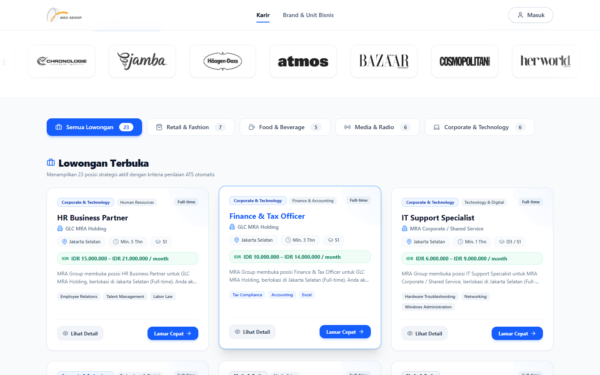

Setiap kartu lowongan menampilkan:
- Bidang usaha, divisi, dan tipe kerja (Full-time, Contract, dan lainnya).
- Nama posisi dan unit usaha.
- Lokasi, minimal pengalaman, dan minimal pendidikan.
- Kisaran gaji, jika dicantumkan.
- Ringkasan pekerjaan dan keahlian utama yang dicari.

Klik **Lihat Detail** untuk membaca selengkapnya, atau **Lamar Cepat** untuk langsung melamar.

---

## 3. Membaca detail lowongan

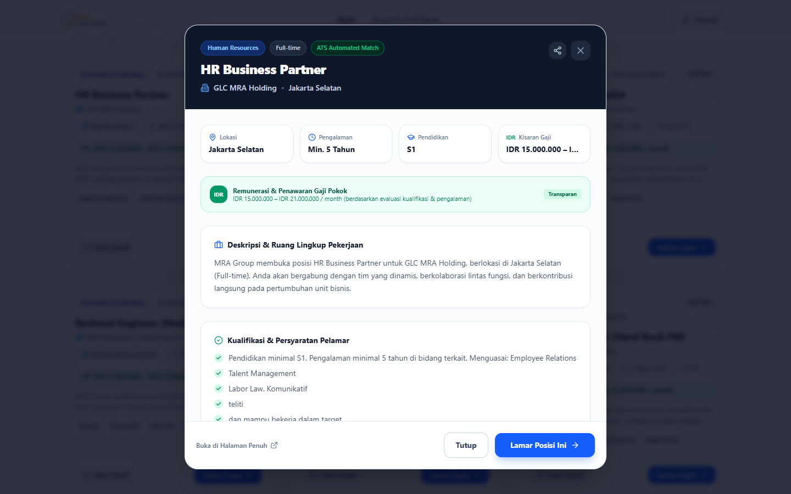

Di halaman detail Anda akan menemukan:

- **Ringkasan**: lokasi, pengalaman, pendidikan, dan kisaran gaji.
- **Deskripsi & ruang lingkup pekerjaan**.
- **Kualifikasi & persyaratan pelamar**.
- **Keahlian & kata kunci yang dibutuhkan**:
  - *Keahlian utama (must-have)* paling menentukan penilaian.
  - *Nilai tambah (nice-to-have)* menambah poin.
- **Benefit & fasilitas karyawan** MRA Group.

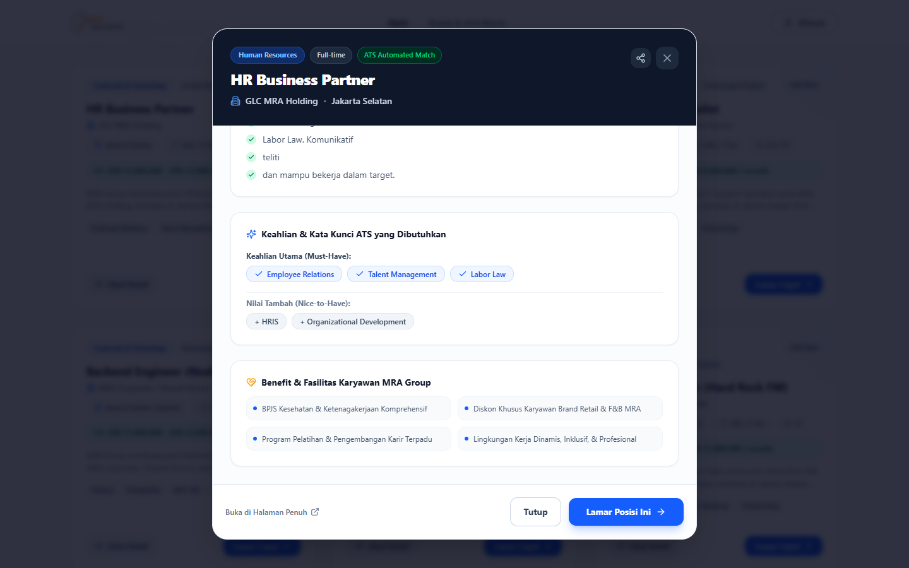

Tombol di bagian bawah:
- **Lamar Posisi Ini**: membuka form lamaran.
- **Buka di Halaman Penuh**: membuka halaman khusus lowongan ini, yang alamatnya bisa disimpan atau dibagikan.
- Ikon **bagikan** (kanan atas): membagikan lowongan ke teman.

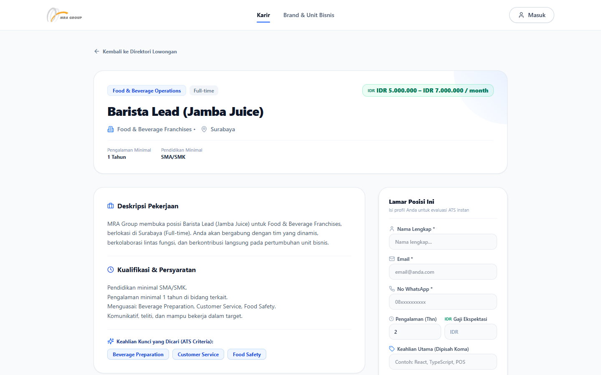

Di halaman khusus lowongan juga tersedia form singkat **Lamar Posisi Ini** di sisi kanan, untuk melamar dengan mengisi data secara manual.

> Perhatikan **keahlian utama** yang dicari. Jika Anda memilikinya, pastikan keahlian itu tertulis jelas di CV Anda (lihat [bagian 6](#6-tips-agar-cv-terbaca-dengan-baik)).

---

## 4. Melamar dengan CV (cara utama)

Klik **Lamar Cepat** atau **Lamar Posisi Ini**. Form lamaran terbuka di tab **Mode 1: Upload CV ATS (Auto-Fill)**.

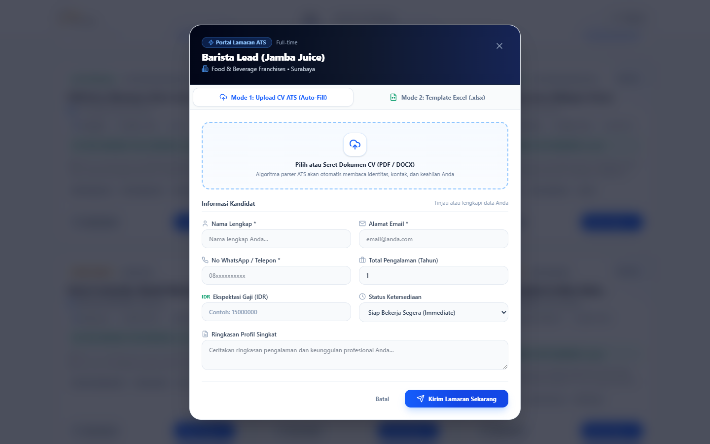

**Langkah 1 — Unggah CV.** Klik kotak bergaris lalu pilih file CV Anda (**PDF atau DOCX**), atau seret file ke kotak tersebut. Sistem membaca CV Anda dalam beberapa detik.

**Langkah 2 — Periksa data yang terisi otomatis.** Nama, email, nomor HP, pengalaman, ringkasan profil, dan keahlian diambil dari CV. Kolom yang terisi otomatis diberi label hijau **ATS Auto-filled**, dan di bawahnya tampil **Keahlian Terekstrak** dari CV Anda.

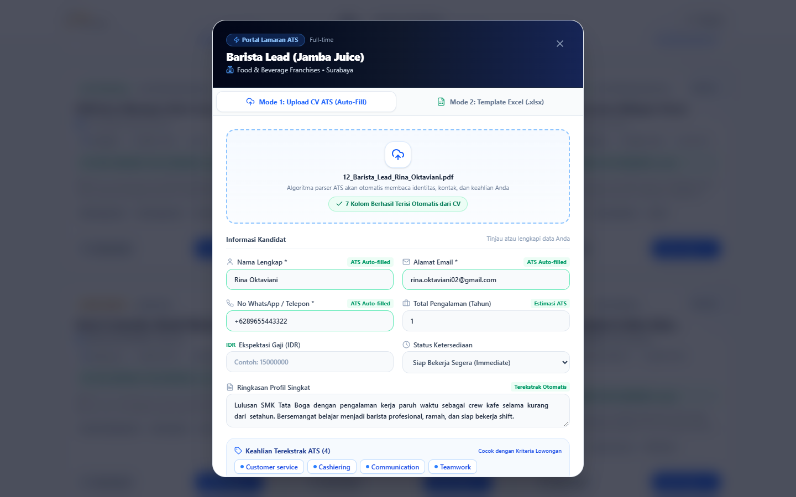

**Langkah 3 — Lengkapi dan perbaiki.**

| Isian | Keterangan |
|---|---|
| **Nama Lengkap** \* | Sesuai KTP. |
| **Alamat Email** \* | Email aktif. **Dipakai untuk melacak status lamaran**, jadi pastikan benar. |
| **No WhatsApp / Telepon** \* | Nomor aktif. Undangan interview bisa dikirim lewat WhatsApp. |
| **Total Pengalaman (Tahun)** | Perkiraan dari CV. Ubah jika kurang tepat (boleh desimal, misalnya 1,5). |
| **Ekspektasi Gaji (IDR)** | Opsional. Gaji per bulan yang Anda harapkan, misalnya `8000000`. |
| **Status Ketersediaan** | *Siap Bekerja Segera*, *Notice 1 Bulan*, atau *Terbuka untuk Peluang*. |
| **Ringkasan Profil Singkat** | Ringkasan pengalaman dan keunggulan Anda. |

**Langkah 4 — Kirim.** Klik **Kirim Lamaran Sekarang**.

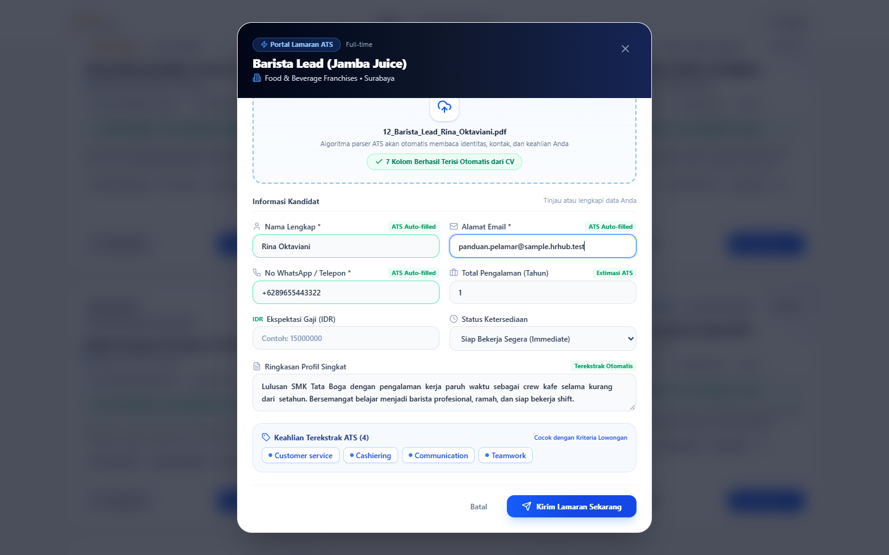

Setelah terkirim, muncul konfirmasi **Lamaran Berhasil Didaftarkan!** beserta **skor kecocokan** CV Anda dengan lowongan tersebut.

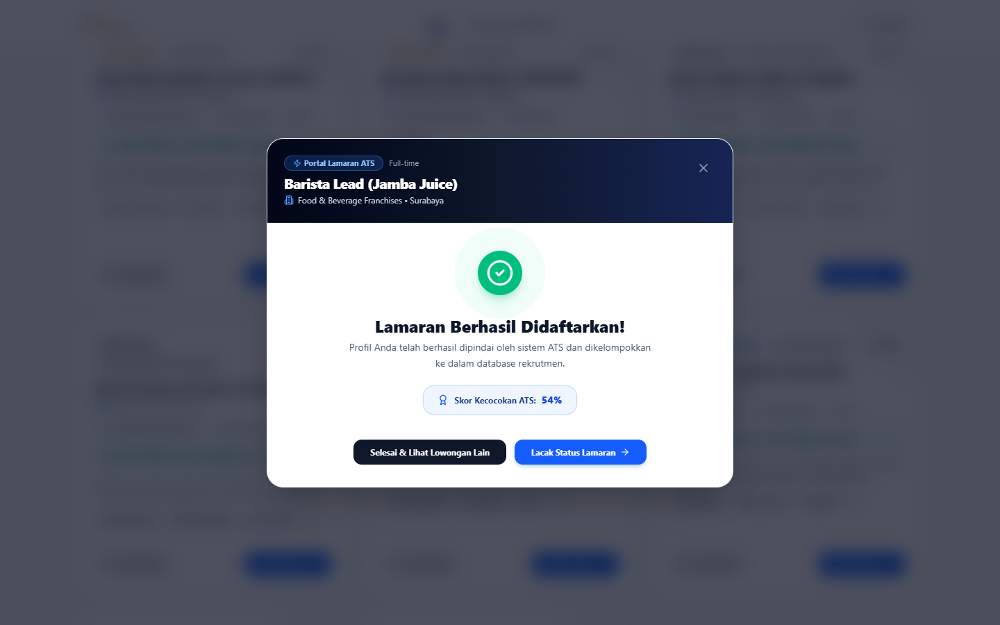

- **Selesai & Lihat Lowongan Lain**: kembali ke daftar lowongan.
- **Lacak Status Lamaran**: membuka halaman status (lihat [bagian 7](#7-melacak-status-lamaran)).

> **Skor kecocokan** adalah penilaian awal otomatis, bukan keputusan akhir. Tim rekrutmen tetap meninjau setiap lamaran.

---

## 5. Melamar dengan template Excel

Jika CV Anda tidak bisa dibaca (misalnya berupa hasil scan/foto), gunakan tab **Mode 2: Template Excel (.xlsx)**.

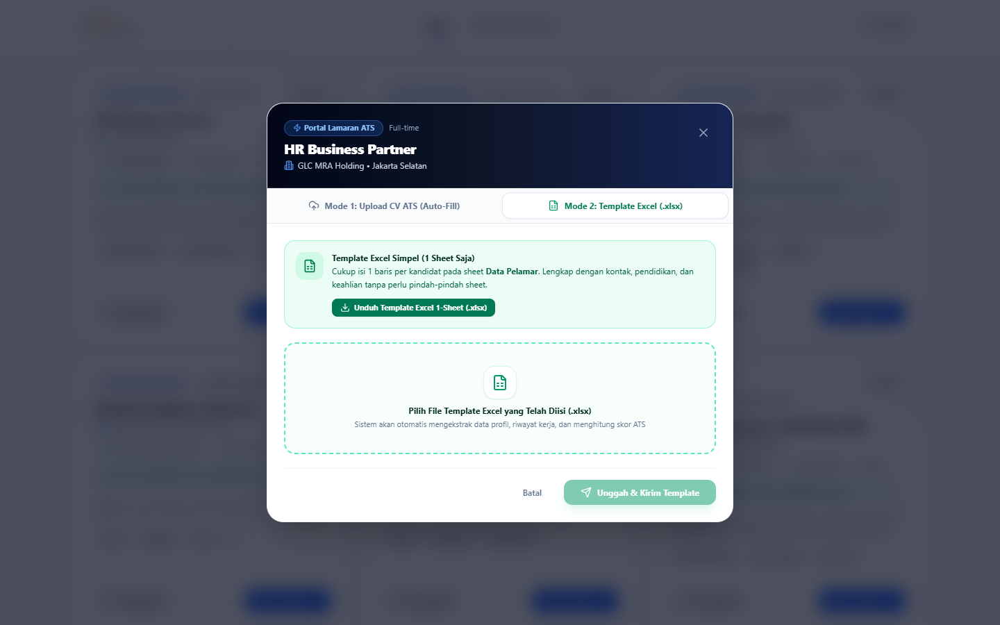

1. Klik **Unduh Template Excel 1-Sheet (.xlsx)**.
2. Buka file tersebut, lalu isi **satu baris** data Anda pada sheet **Data Pelamar** (kontak, pendidikan, dan keahlian). Baris contoh bawaan template boleh dibiarkan, karena tidak ikut terkirim.
3. Simpan file, lalu klik kotak **Pilih File Template yang Telah Diisi (.xlsx)** dan pilih file tersebut.
4. Klik **Unggah & Kirim Template**.

---

## 6. Tips agar CV terbaca dengan baik

Sistem membaca **teks** di dalam CV Anda. Agar penilaiannya akurat:

- **Gunakan PDF atau DOCX yang dibuat dari Word / Google Docs / Canva**, bukan foto atau hasil scan. Teks di dalam gambar tidak bisa dibaca.
- **Tulis judul bagian yang jelas**: *Ringkasan / Profil*, *Pengalaman Kerja*, *Pendidikan*, *Keahlian / Skills*.
- **Cantumkan keahlian yang relevan secara eksplisit**, dengan istilah yang umum dipakai. Contohnya *Visual Merchandising*, *Customer Service*, *Microsoft Excel*, *Food Safety*. Cocokkan dengan *Keahlian utama* di detail lowongan, tapi tulis hanya yang benar-benar Anda kuasai.
- **Tulis periode kerja dengan tahun**, misalnya *Mei 2021 – Sekarang*, agar lama pengalaman terhitung.
- **Cantumkan jenjang pendidikan** dengan jelas, misalnya *S1 Manajemen*, *D3 Perhotelan*, atau *SMK Tata Boga*.
- **Pastikan email dan nomor HP di CV masih aktif.**
- Hindari tabel atau kolom yang terlalu rumit dan teks di dalam gambar atau ikon.

---

## 7. Melacak status lamaran

Klik **Lacak Status Lamaran** (di bagian bawah halaman, di menu ☰ pada HP, atau setelah melamar). Masukkan **email yang Anda pakai saat melamar**, lalu klik **Lacak**.

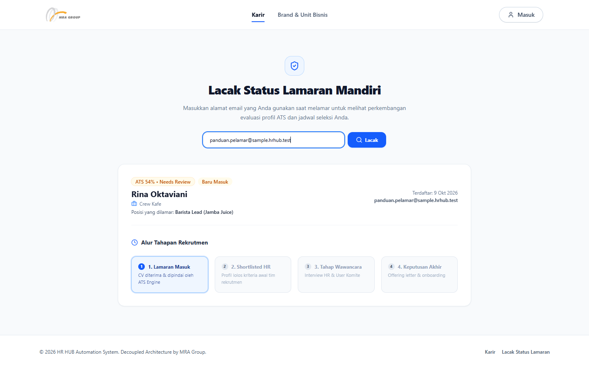

Halaman status menampilkan:
- Nama Anda dan **posisi yang dilamar**.
- Label status dan skor kecocokan.
- Tanggal terdaftar.
- **Alur Tahapan Rekrutmen** 4 langkah. Langkah berwarna **biru** adalah posisi Anda saat ini, dan langkah **hijau** ✓ sudah dilewati.

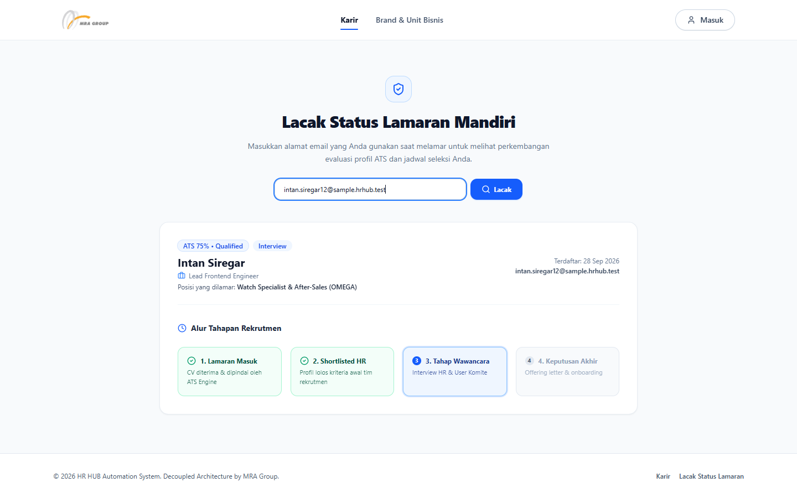

| Langkah | Artinya |
|---|---|
| **1. Lamaran Masuk** | CV Anda sudah diterima dan dinilai sistem. Tim rekrutmen sedang meninjau. |
| **2. Shortlisted HR** | Profil Anda lolos kriteria awal tim rekrutmen. |
| **3. Tahap Wawancara** | Anda dalam tahap interview HR dan/atau interview dengan calon atasan (user). Jadwal dikirim lewat email atau WhatsApp. |
| **4. Keputusan Akhir** | Tahap penawaran kerja (offer letter). |
| Semua langkah hijau, label **Diterima** | Selamat, Anda diterima! |

Label status lain yang mungkin muncul:

| Label | Artinya |
|---|---|
| **Baru Masuk** / **ATS Screened** | Lamaran sudah diterima dan sedang ditinjau. |
| **Shortlisted** / **Interview** / **Offering Letter** | Sesuai tahap pada alur di atas. |
| **Tidak Lolos** | Lamaran untuk posisi ini tidak dilanjutkan. Anda tetap dapat melamar posisi lain. |
| **Talent Pool** | Profil Anda disimpan untuk peluang lain yang lebih sesuai. Tim rekrutmen dapat menghubungi Anda saat ada posisi yang cocok. |

Jika muncul pesan **"Tidak ditemukan data lamaran dengan email …"**, periksa kembali penulisan email Anda. Gunakan email yang sama persis dengan saat melamar.

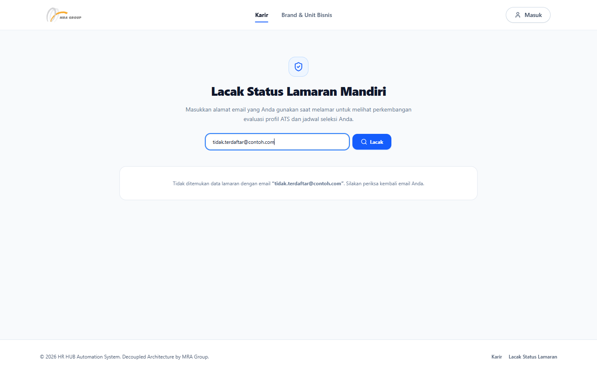

---

## 8. Setelah lolos seleksi

- **Undangan interview** dikirim oleh tim rekrutmen melalui email dan/atau WhatsApp, berisi tanggal, jam (WIB), mode (online dengan link meeting, atau onsite dengan alamat), dan nama pewawancara. Anda bisa menambahkannya ke kalender HP Anda.
- **Surat penawaran kerja (offer letter)** dikirim dalam bentuk PDF lewat email atau WhatsApp. Isinya posisi, tanggal mulai bekerja, gaji dan tunjangan, fasilitas, serta **batas waktu** untuk menjawab.
- Jika Anda menerima tawaran, **tandatangani bagian Pernyataan Persetujuan** di surat tersebut dan kirimkan kembali sebelum batas waktunya.
- Setelah bergabung, tim HR akan memandu proses hari pertama: kontrak kerja, dokumen (KTP, NPWP, KK, ijazah, rekening), akun kerja, dan orientasi.

---

## 9. Pertanyaan umum

**Apakah saya perlu membuat akun?**
Tidak. Cukup isi form lamaran. Tombol **Masuk** di kanan atas khusus untuk karyawan dan tim HR MRA Group.

**Bolehkah saya melamar lebih dari satu posisi?**
Boleh. Lamar setiap posisi yang sesuai dengan email yang sama. Halaman status menampilkan **lamaran terakhir** Anda, dan tim rekrutmen tetap melihat semua lamaran Anda.

**Saya salah mengisi data atau ingin memperbarui CV. Apa yang harus dilakukan?**
Data profil yang sudah tersimpan tidak berubah otomatis saat Anda melamar ulang. Sampaikan perubahan penting (misalnya nomor HP baru) kepada tim rekrutmen saat Anda dihubungi.

**Berapa lama sampai saya dihubungi?**
Waktunya berbeda untuk setiap posisi. Pantau status lamaran Anda secara berkala di halaman **Lacak Status Lamaran**.

**CV saya tidak terbaca / kolom tidak terisi otomatis.**
Kemungkinan CV berupa gambar atau hasil scan. Isi kolomnya secara manual di form yang sama, unggah ulang CV dalam format PDF/DOCX berbasis teks, atau gunakan **template Excel**.

**Apakah melamar di MRA Group dipungut biaya?**
Proses lamaran melalui portal ini tidak memerlukan pembayaran apa pun. Waspadai pihak yang meminta biaya atas nama rekrutmen MRA Group.

**Bisakah saya melamar lewat HP?**
Bisa. Portal karier menyesuaikan tampilan di HP. Pencarian, detail lowongan, upload CV, dan cek status semuanya tersedia.

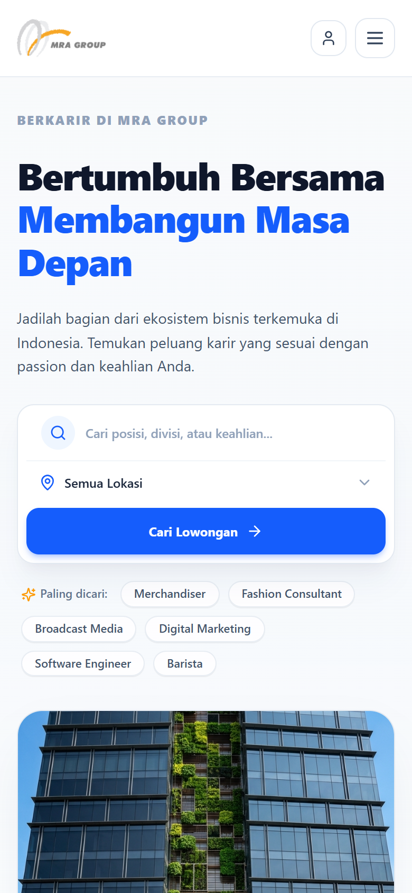
