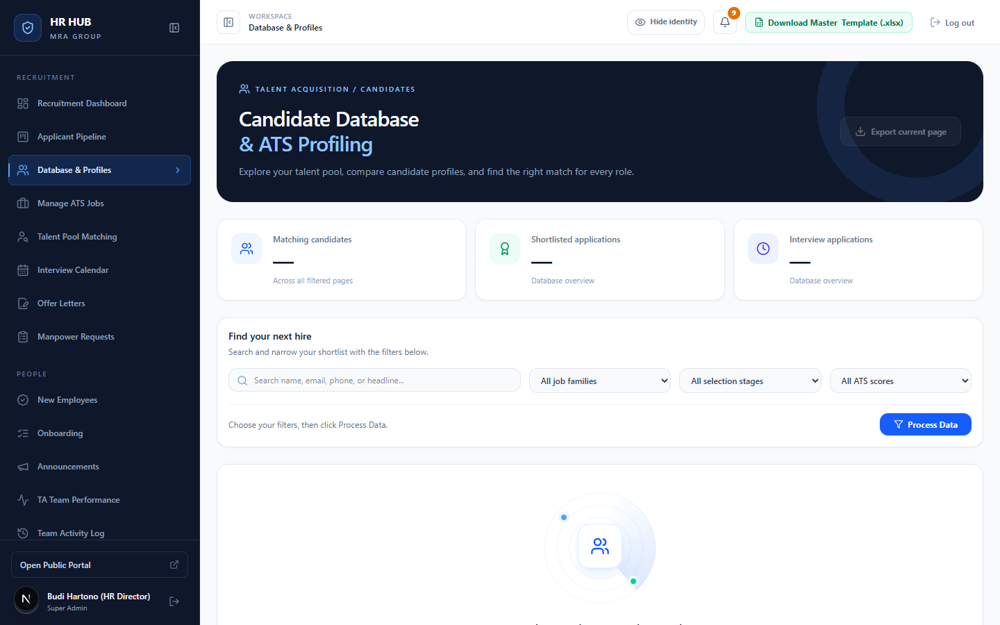
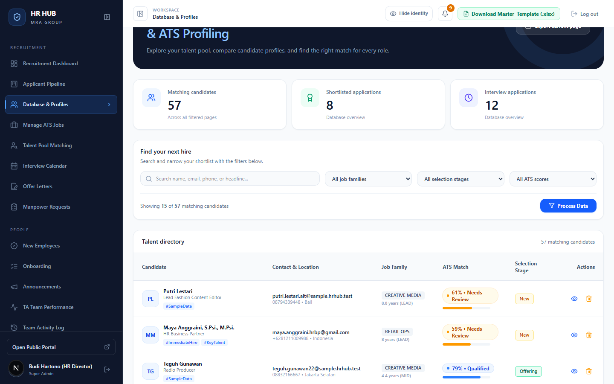
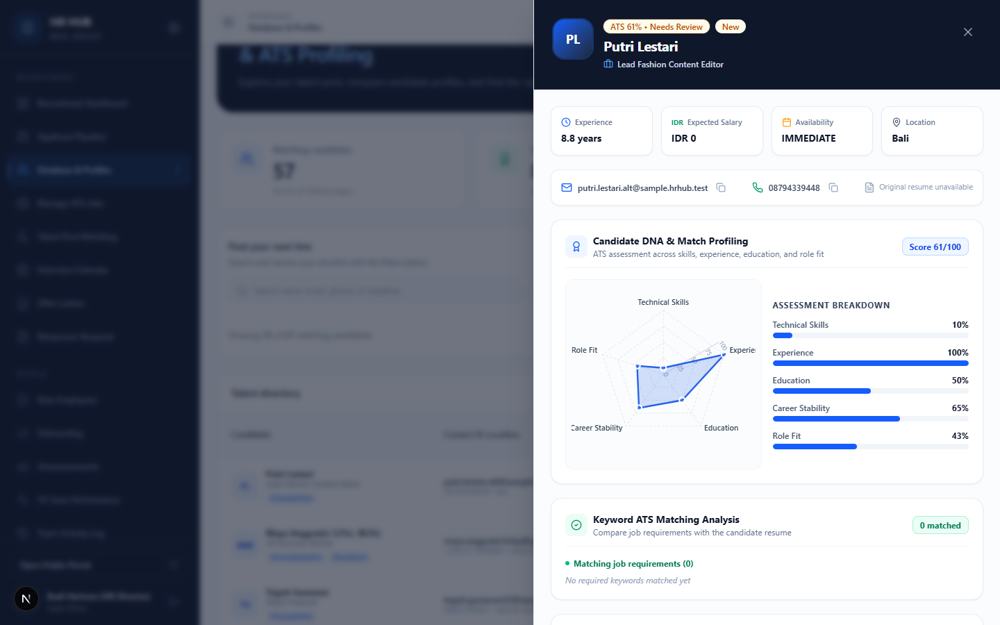
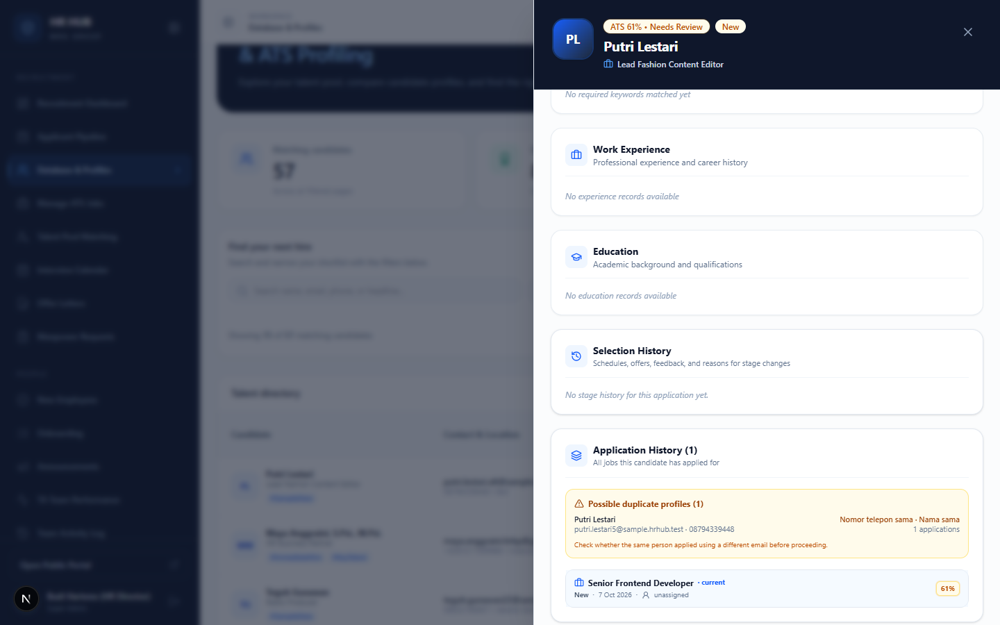

# Panduan Database & Profiles (Database Kandidat)

**HR HUB · MRA Group** — untuk Recruiter (TA), TA Lead, HR Director, dan Hiring Manager

Database & Profiles adalah daftar semua kandidat yang pernah masuk ke HR HUB, baik dari portal karier, upload CV, maupun import template Excel. Gunakan menu ini untuk mencari kandidat, membaca profil ATS-nya, dan memeriksa riwayat lamarannya.

Menu: **Recruitment → Database & Profiles** (`/admin/candidates`)

---

## Daftar isi

1. [Mencari kandidat](#1-mencari-kandidat)
2. [Membaca daftar kandidat](#2-membaca-daftar-kandidat)
3. [Profil kandidat](#3-profil-kandidat)
4. [Riwayat lamaran & profil ganda](#4-riwayat-lamaran--profil-ganda)
5. [Ekspor & hapus](#5-ekspor--hapus)
6. [Pertanyaan umum](#6-pertanyaan-umum)

---

## 1. Mencari kandidat

Daftar tidak dimuat otomatis, supaya halaman tetap ringan. Atur filter dulu, lalu klik **Process Data**.

| Filter | Keterangan |
|---|---|
| **Search** | Nama, email, nomor HP, atau headline. |
| **Job family** | IT & Digital, Retail & Store Operations, Corporate, Creative & Broadcasting. |
| **Selection stage** | Tahap lamaran terakhir kandidat (Applied … Hired, Rejected, Talent Pool). |
| **ATS score** | Top Match (≥85), Qualified (≥75), Passing (≥60). |

Kartu di atas menunjukkan jumlah kandidat yang cocok dengan filter, serta jumlah lamaran di tahap Shortlisted dan Interview.

---

## 2. Membaca daftar kandidat

| Kolom | Isi |
|---|---|
| **Candidate** | Nama, headline, dan tag otomatis (misalnya `#KeyTalent`, `#ImmediateHire`). |
| **Contact & Location** | Email, nomor HP, dan kota. |
| **Job Family** | Kelompok pekerjaan dan lama pengalaman (ENTRY, MID, SENIOR, LEAD). |
| **ATS Match** | Skor lamaran terakhir: hijau *Top Match*, biru *Qualified*, oranye *Needs Review*. |
| **Selection Stage** | Tahap lamaran terakhir. |
| **Actions** | 👁 buka profil · 🗑 hapus (khusus TA Lead dan Super Admin). |

Daftar ditampilkan per halaman. Gunakan tombol halaman di bagian bawah.

---

## 3. Profil kandidat

Klik baris atau ikon 👁 untuk membuka profil.

Isi profil:
- **Ringkasan**: pengalaman, ekspektasi gaji, ketersediaan (notice period), dan lokasi.
- **Kontak**: email dan nomor HP (klik ikon untuk menyalin), plus tombol **CV asli** jika kandidat mengunggah CV.
- **Candidate DNA & Match Profiling**: grafik radar 5 pilar (keahlian teknis, pengalaman, pendidikan, stabilitas karier, kecocokan lowongan) dan rincian skornya.
- **Keyword ATS Matching Analysis**: kata kunci lowongan yang ditemukan (✓ hijau) dan yang tidak ditemukan di CV.
- **Work Experience** dan **Education**.
- **Recruiter Evaluation**: rating bintang, catatan internal, dan perubahan tahap. Hanya perubahan tanpa syarat yang bisa dilakukan di sini. Perpindahan yang butuh isian (interview, offering, hired) dilakukan di Applicant Pipeline.

> **Cara skor ATS dihitung:** 55% keahlian (kata kunci *must-have* paling berbobot), 30% pengalaman, dan 15% pendidikan, dibandingkan dengan kriteria lowongan. Skor dihitung saat kandidat melamar.

---

## 4. Riwayat lamaran & profil ganda

Di bagian bawah profil:

- **Selection History**: semua perpindahan tahap untuk lamaran ini, dengan jadwal interview, gaji, alasan, dan persetujuannya.
- **Application History**: semua lowongan yang pernah dilamar orang ini, beserta tahap dan skornya.
- **Possible duplicate profiles** (kotak kuning, hanya untuk tim TA): profil lain dengan nomor HP sama (9 digit terakhir) atau nama sama tanpa gelar. Periksa dulu sebelum memproses. Bisa jadi orang yang sama melamar dengan email berbeda.

---

## 5. Ekspor & hapus

- **Export current page** (kanan atas): mengunduh kandidat di halaman yang sedang tampil.
- **Hapus kandidat** (🗑, TA Lead dan Super Admin): menghapus kandidat beserta semua lamarannya dan file CV-nya. Tindakan ini **tidak bisa dibatalkan**. Untuk kandidat yang hanya tidak cocok, cukup pindahkan ke *Rejected* atau *Talent Pool* di Pipeline.

---

## 6. Pertanyaan umum

**Kandidat melamar ulang dengan data baru, tapi profilnya tidak berubah.**
Ini disengaja. Lamaran dari portal karier tidak pernah menimpa profil yang sudah ada (dicocokkan lewat email). Data kirimannya tetap tercatat di riwayat sebagai *Profile resubmitted*. Profil hanya diperbarui lewat import template Excel oleh tim TA.

**Skor ATS lama tidak berubah setelah kriteria lowongan saya ubah.**
Skor dihitung saat melamar. Untuk melihat kecocokan kandidat lama dengan kriteria terbaru, gunakan [Talent Pool Matching](../talent-pool/README.md).

**Hiring Manager tidak melihat semua kandidat.**
Hiring Manager hanya melihat kandidat dari lowongannya sendiri (dan lowongan tanpa Hiring Manager).
