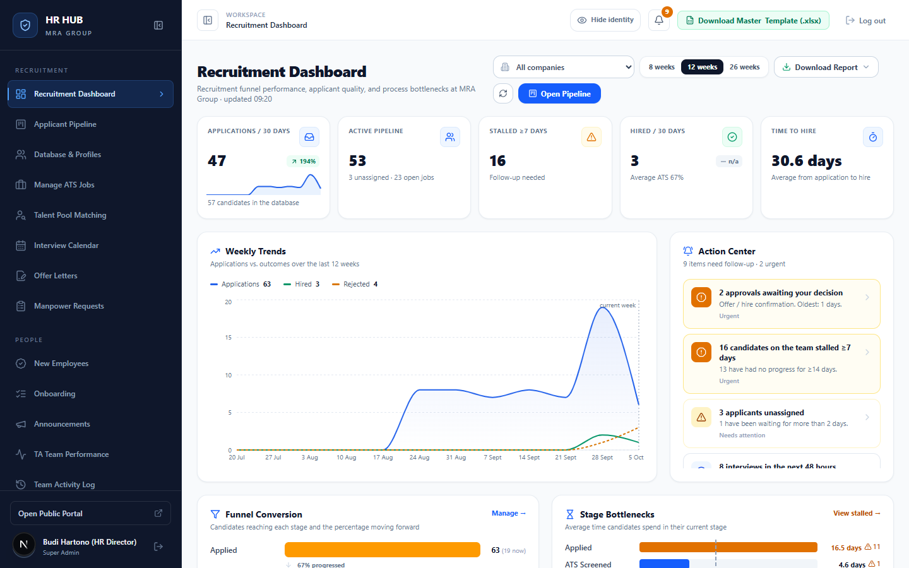
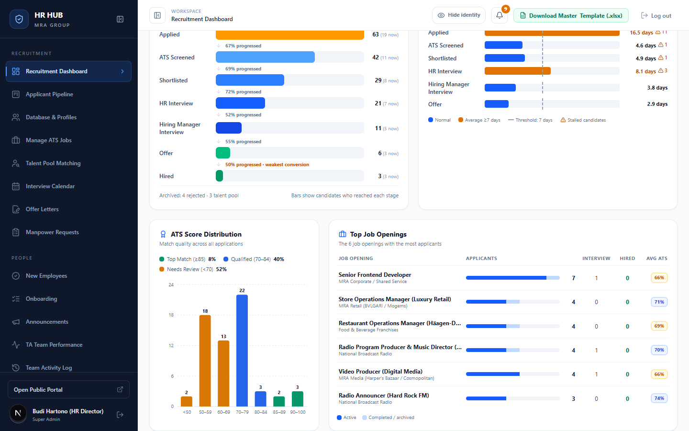
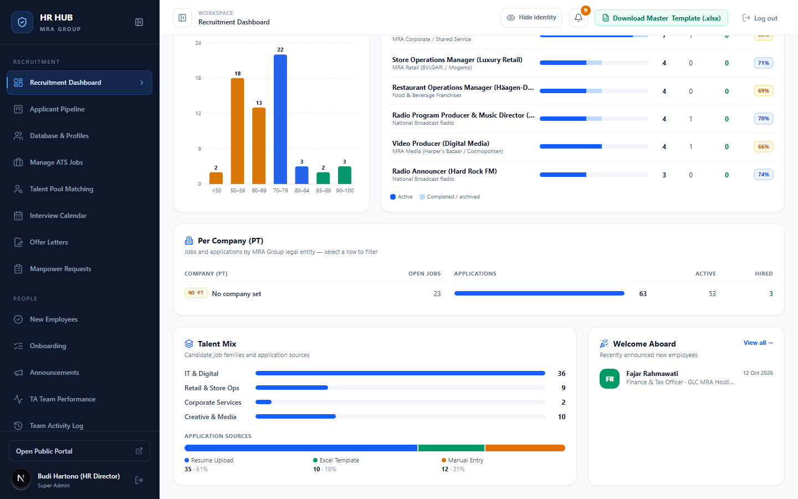
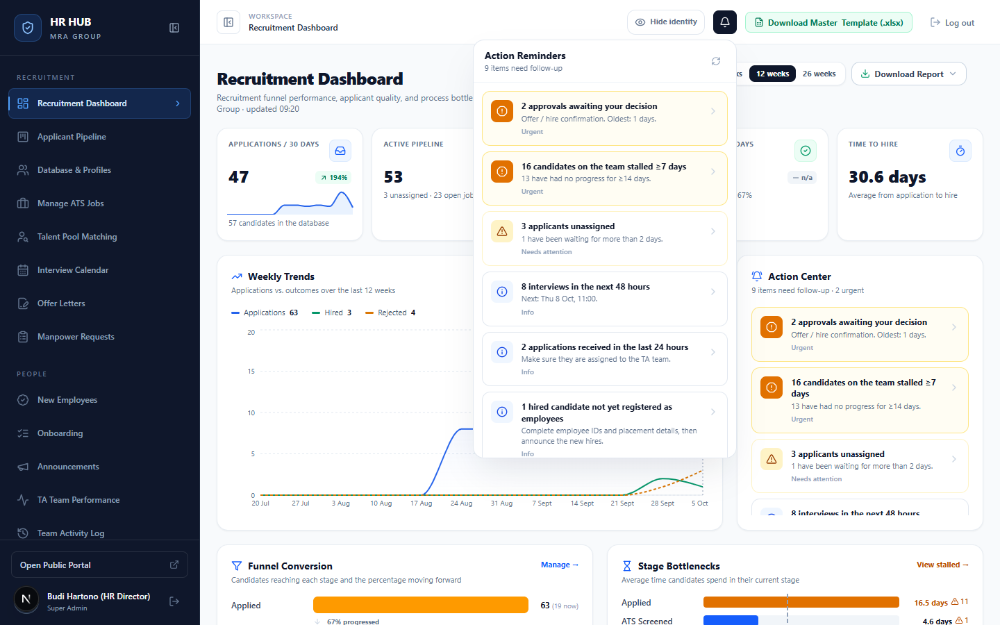

# Panduan Recruitment Dashboard

**HR HUB · MRA Group** — untuk semua pengguna CMS (HR Director, TA Lead, Recruiter, Hiring Manager)

Dashboard adalah halaman pertama setelah login. Di sini Anda melihat kondisi rekrutmen secara keseluruhan: berapa pelamar yang masuk, siapa yang tertahan, tahap mana yang paling lambat, dan apa yang perlu ditindaklanjuti hari ini.

Menu: **Recruitment → Recruitment Dashboard** (`/admin`)

---

## Daftar isi

1. [Bagian atas: filter dan angka utama](#1-bagian-atas-filter-dan-angka-utama)
2. [Weekly Trends dan Action Center](#2-weekly-trends-dan-action-center)
3. [Funnel Conversion dan Stage Bottlenecks](#3-funnel-conversion-dan-stage-bottlenecks)
4. [Kualitas pelamar, lowongan teratas, dan per PT](#4-kualitas-pelamar-lowongan-teratas-dan-per-pt)
5. [Mengunduh laporan rekrutmen](#5-mengunduh-laporan-rekrutmen)
6. [Lonceng pengingat](#6-lonceng-pengingat)
7. [Pertanyaan umum](#7-pertanyaan-umum)

---

## 1. Bagian atas: filter dan angka utama

| Kontrol | Fungsi |
|---|---|
| **All companies** | Membatasi semua angka ke satu PT. Pilih *No company set* untuk lowongan yang belum punya PT. |
| **8 / 12 / 26 weeks** | Rentang grafik tren mingguan. |
| **Download Report** | Mengunduh laporan Excel (lihat [bagian 5](#5-mengunduh-laporan-rekrutmen)). |
| ⟳ | Memuat ulang data. |
| **Open Pipeline** | Langsung ke papan Applicant Pipeline. |

Lima kartu di atas:

| Kartu | Arti |
|---|---|
| **Applications / 30 days** | Lamaran baru 30 hari terakhir, dengan persentase naik/turun dibanding 30 hari sebelumnya. |
| **Active pipeline** | Lamaran yang masih berjalan, berapa yang belum punya PIC, dan jumlah lowongan buka. |
| **Stalled ≥7 days** | Kandidat yang tidak bergerak tahapnya selama 7 hari atau lebih. |
| **Hired / 30 days** | Kandidat yang diterima 30 hari terakhir, beserta rata-rata skor ATS-nya. |
| **Time to hire** | Rata-rata hari dari melamar sampai diterima. |

---

## 2. Weekly Trends dan Action Center

- **Weekly Trends**: jumlah lamaran (biru), diterima (hijau), dan ditolak (oranye) per minggu. Garis putus-putus menandai minggu berjalan.
- **Action Center**: daftar hal yang perlu ditindaklanjuti oleh **Anda**, diurutkan dari yang paling mendesak. Contohnya persetujuan yang menunggu keputusan, kandidat tertahan, pelamar tanpa PIC, interview 48 jam ke depan, atau karyawan baru yang belum didaftarkan. Klik salah satu item untuk langsung membuka halaman terkait (misalnya Pipeline dengan filter *Stalled*).

Label prioritas: **Urgent** (merah/oranye) → **Needs attention** (kuning) → **Info** (biru).

---

## 3. Funnel Conversion dan Stage Bottlenecks

- **Funnel Conversion** menunjukkan berapa kandidat yang **pernah mencapai** tiap tahap, plus persentase yang lanjut ke tahap berikutnya. Angka kecil "(19 now)" adalah jumlah yang saat ini berada di tahap itu. Tahap dengan konversi terendah diberi tanda *weakest conversion*.
- **Stage Bottlenecks** menunjukkan rata-rata lama kandidat berada di tahapnya sekarang. Garis putus-putus adalah batas 7 hari. Batang oranye berarti rata-ratanya sudah melewati 7 hari, dan ikon ⚠ menunjukkan jumlah kandidat yang tertahan. Klik **View stalled →** untuk membuka daftarnya di Pipeline.

---

## 4. Kualitas pelamar, lowongan teratas, dan per PT

| Kartu | Isi |
|---|---|
| **ATS Score Distribution** | Sebaran skor ATS semua lamaran: *Top Match* (≥85), *Qualified* (70–84), *Needs Review* (<70). |
| **Top Job Openings** | 6 lowongan dengan pelamar terbanyak, jumlah interview, diterima, dan rata-rata ATS. |
| **Per Company (PT)** | Lowongan buka, lamaran, aktif, dan diterima per PT. Klik baris untuk memfilter dashboard ke PT itu. |
| **Talent Mix** | Kelompok pekerjaan pelamar (IT, Retail, Corporate, Creative) dan sumber lamaran (upload CV, template Excel, input manual). |
| **Welcome Aboard** | Karyawan baru yang sudah diumumkan. |

> Saat lowongan belum diberi PT, semua angka masuk ke baris **No company set**. Isi PT di menu *Manage ATS Jobs* agar laporan per PT akurat.

---

## 5. Mengunduh laporan rekrutmen

Klik **Download Report**, lalu pilih periodenya: *This month*, *Last month*, *Last 30 days*, atau *Last 90 days*.

File Excel berisi sheet: **Ringkasan**, **Per Lowongan**, **Per Recruiter**, **Per PT**, **Diterima**, dan **Pelamar**. Laporan ini tersedia untuk TA Lead dan Super Admin.

---

## 6. Lonceng pengingat

Ikon lonceng 🔔 di kanan atas tersedia di semua halaman. Angka oranye menunjukkan jumlah pengingat yang belum Anda lihat. Isinya sama dengan Action Center dan diperbarui otomatis setiap menit.

Pengingat dihitung khusus untuk Anda sesuai peran. Contohnya, Recruiter melihat kandidat miliknya yang tertahan, Hiring Manager melihat konfirmasi hire untuk lowongannya, dan TA Lead melihat antrean yang belum diambil.

---

## 7. Pertanyaan umum

**Kenapa angka saya berbeda dengan rekan saya?**
Hiring Manager hanya melihat data lowongannya sendiri (dan lowongan tanpa Hiring Manager). Action Center dan lonceng juga dihitung per pengguna.

**Apakah dashboard otomatis diperbarui?**
Angka dimuat saat halaman dibuka. Klik ⟳ untuk memuat ulang. Lonceng memperbarui dirinya setiap 60 detik.

**Kandidat yang sudah didaftarkan sebagai karyawan tidak terlihat di Pipeline. Apakah tetap dihitung?**
Ya. Mereka tetap dihitung sebagai *Hired* di dashboard dan laporan.
