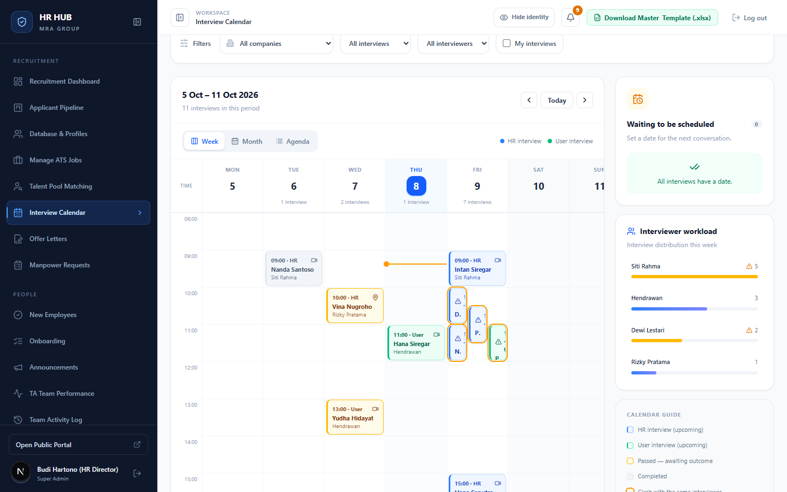
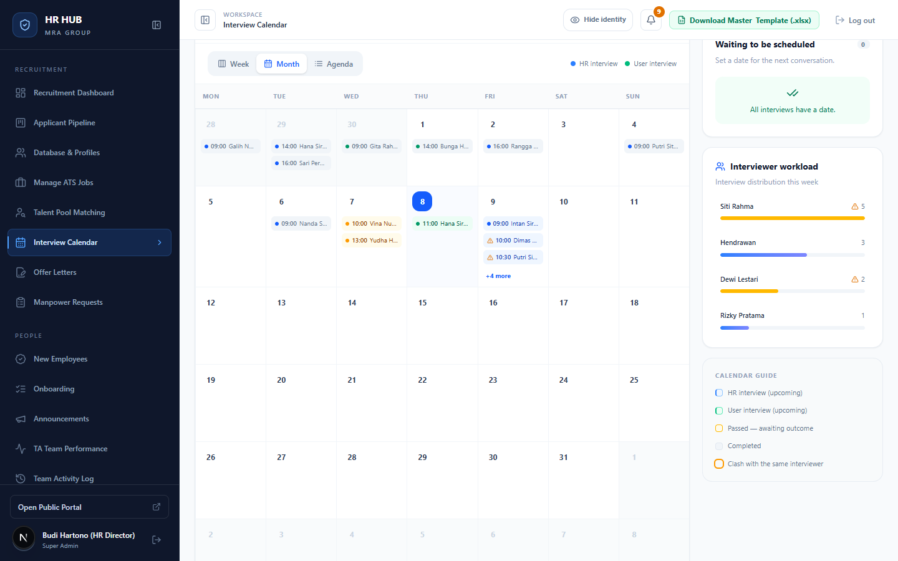
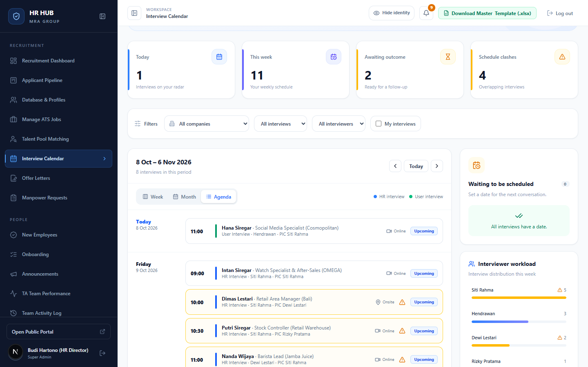
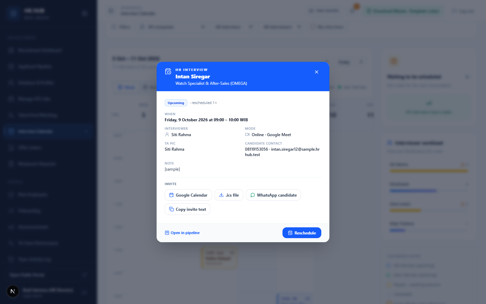

# Panduan Interview Calendar

**HR HUB · MRA Group** — untuk Recruiter (TA), TA Lead, HR Director, dan Hiring Manager

Interview Calendar mengumpulkan semua jadwal interview HR dan interview user dari pipeline dalam satu kalender. Jadwal tidak perlu diketik dua kali: jadwal yang diisi saat memindahkan kandidat ke tahap *Interview HR* atau *Interview User* otomatis muncul di sini.

Menu: **Recruitment → Interview Calendar** (`/admin/interviews`) · Hiring Manager hanya melihat interview untuk lowongannya.

---

## Daftar isi

1. [Ringkasan & filter](#1-ringkasan--filter)
2. [Tampilan Week, Month, Agenda](#2-tampilan-week-month-agenda)
3. [Arti warna & status](#3-arti-warna--status)
4. [Detail interview & undangan](#4-detail-interview--undangan)
5. [Menjadwalkan & menjadwalkan ulang](#5-menjadwalkan--menjadwalkan-ulang)
6. [Pertanyaan umum](#6-pertanyaan-umum)

---

## 1. Ringkasan & filter

Empat kartu di atas:

| Kartu | Arti |
|---|---|
| **Today** | Interview hari ini. |
| **This week** | Interview minggu ini. |
| **Awaiting outcome** | Waktu interview sudah lewat, tapi kandidat belum dipindahkan ke tahap berikutnya. |
| **Schedule clashes** | Pewawancara yang sama punya interview di jam yang bertabrakan. |

Filter: PT, jenis interview (HR / User), pewawancara, dan **My interviews** (interview kandidat milik Anda).

---

## 2. Tampilan Week, Month, Agenda

**Week**: jadwal jam 08.00–19.00. Garis oranye menandai waktu sekarang. Interview yang bertumpuk ditampilkan berdampingan.

**Month**: ringkasan sebulan. Klik **+n more** untuk melihat sisanya.

**Agenda**: daftar interview sekitar satu bulan ke depan, dikelompokkan per hari, lengkap dengan lowongan, pewawancara, PIC, dan mode.

Gunakan ‹ **Today** › untuk berpindah periode.

Panel kanan:
- **Waiting to be scheduled**: kandidat yang sudah di tahap interview tapi belum punya jadwal, dengan tombol *Schedule*.
- **Interviewer workload**: jumlah interview per pewawancara minggu ini. ⚠ menandai jadwal yang bertabrakan.
- **Calendar guide**: legenda warna.

---

## 3. Arti warna & status

| Tampilan | Arti |
|---|---|
| Biru | Interview HR (akan datang) |
| Hijau | Interview User (akan datang) |
| Kuning | Sudah lewat, **menunggu hasil**: pindahkan kandidat di Pipeline |
| Abu-abu | Selesai (kandidat sudah pindah tahap setelah interview) |
| Garis oranye + ⚠ | Bentrok dengan interview lain untuk pewawancara yang sama |

Interview yang batal (kandidat pindah tahap sebelum waktunya) tidak ditampilkan di Week dan Month, tapi tetap terlihat di Agenda.

---

## 4. Detail interview & undangan

Klik salah satu interview untuk membuka detailnya.

Isinya:
- Status (misalnya *Upcoming · rescheduled 1×*).
- Waktu (WIB), pewawancara, mode (online dengan link atau onsite dengan lokasi), PIC TA, kontak kandidat, dan catatan.

Tombol **Invite**:
- **Google Calendar**: membuat acara di Google Calendar Anda.
- **.ics file**: undangan untuk Outlook atau kalender lain.
- **WhatsApp candidate**: membuka WhatsApp dengan pesan undangan yang sudah terisi. Nomor 08… otomatis diubah menjadi 628….
- **Copy invite text**: menyalin teks undangan.

**Open in pipeline** membuka kartu kandidat.

---

## 5. Menjadwalkan & menjadwalkan ulang

- **Jadwal pertama** diisi saat memindahkan kandidat ke *Interview HR* atau *Interview User* di Pipeline (jadwal, pewawancara, dan mode wajib diisi).
- **Reschedule**: dari detail interview, klik **Reschedule**, lalu ubah waktu, pewawancara, atau mode, dan isi alasan penjadwalan ulang. Riwayatnya tersimpan di riwayat kandidat.
- **Schedule** (panel *Waiting to be scheduled*): untuk kandidat di tahap interview yang belum punya jadwal.

Menjadwalkan dan menjadwalkan ulang hanya bisa dilakukan oleh PIC kandidat atau TA Lead.

> Setelah interview selesai, catat hasilnya dengan **memindahkan kandidat** di Pipeline (lanjut, mundur, atau Rejected). Selama belum dipindahkan, interview tetap berstatus *Awaiting outcome*.

---

## 6. Pertanyaan umum

**Jadwal di kalender tidak sesuai dengan yang saya isi.**
Kalender memakai jadwal terakhir. Jika interview pernah dijadwalkan ulang, yang tampil adalah jadwal terbaru.

**Kenapa ada tanda bentrok padahal ruangannya berbeda?**
Tanda bentrok berdasarkan **nama pewawancara**. Satu orang tidak bisa mewawancarai dua kandidat di jam yang sama. Setiap interview dihitung 60 menit.

**Apakah ada pengingat?**
Ya. Lonceng menampilkan interview dalam 48 jam ke depan, dan jadwal ulang ikut terhitung.
