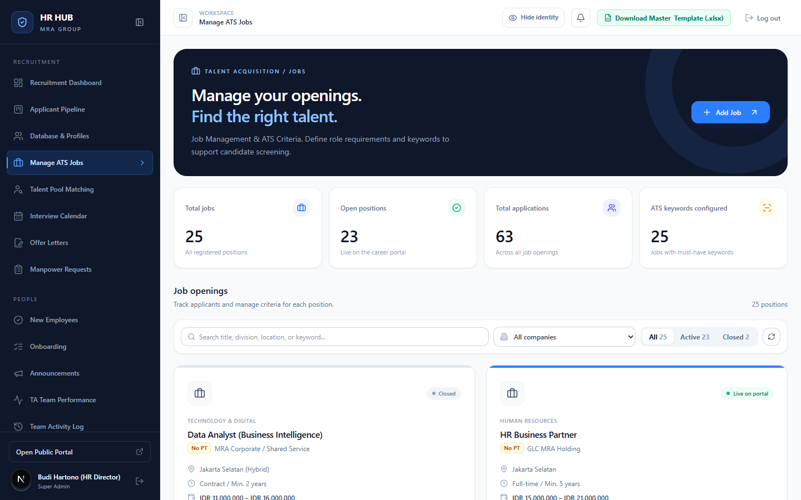
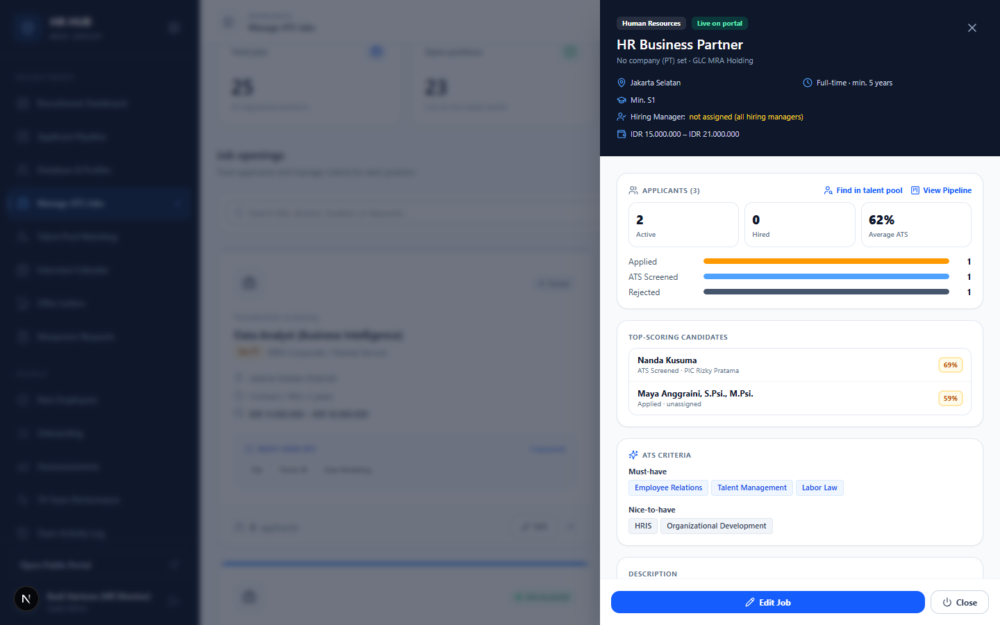
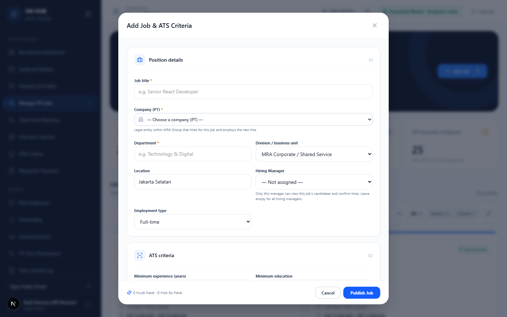
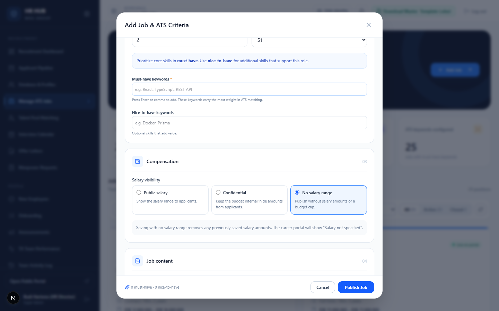

# Panduan Manage ATS Jobs (Kelola Lowongan)

**HR HUB · MRA Group** — untuk TA Lead dan HR Director / Super Admin

Di menu ini lowongan dibuat, diubah, dan ditutup. Kriteria yang Anda isi di sini, terutama **kata kunci must-have**, menjadi dasar skor ATS setiap pelamar. Lowongan yang aktif langsung tampil di portal karier.

Menu: **Recruitment → Manage ATS Jobs** (`/admin/jobs`)

---

## Daftar isi

1. [Daftar lowongan](#1-daftar-lowongan)
2. [Detail lowongan](#2-detail-lowongan)
3. [Membuat atau mengubah lowongan](#3-membuat-atau-mengubah-lowongan)
4. [Kriteria ATS & gaji](#4-kriteria-ats--gaji)
5. [Menutup & menghapus lowongan](#5-menutup--menghapus-lowongan)
6. [Pertanyaan umum](#6-pertanyaan-umum)

---

## 1. Daftar lowongan

- Empat kartu di atas: total lowongan, lowongan yang tayang di portal, total lamaran, dan lowongan yang sudah punya kata kunci must-have.
- Cari lowongan berdasarkan judul, divisi, lokasi, atau kata kunci. Filter per PT, atau pilih tab **All / Active / Closed**.
- Kartu lowongan menampilkan:
  - Departemen dan kode PT. Label oranye **No PT** berarti PT belum diisi.
  - Divisi, lokasi, tipe kerja, minimal pengalaman, dan rentang gaji.
  - Kata kunci must-have dan jumlah pelamar.
  - Status **Live on portal** atau **Closed**.

---

## 2. Detail lowongan

Klik judul lowongan untuk membuka detailnya.

| Bagian | Isi |
|---|---|
| Header | PT, divisi, lokasi, tipe kerja, minimal pendidikan, Hiring Manager, dan gaji. |
| **Applicants** | Jumlah pelamar aktif, diterima, rata-rata ATS, dan sebaran per tahap. **View Pipeline** membuka papan yang sudah difilter ke lowongan ini. **Find in talent pool** mencari kandidat lama yang cocok ([panduan](../talent-pool/README.md)). |
| **Top-scoring candidates** | Pelamar dengan skor ATS tertinggi beserta tahap dan PIC-nya. |
| **ATS criteria** | Kata kunci must-have dan nice-to-have. |
| Description, requirements, benefits | Teks yang tampil di portal karier. |

Tombol bawah: **Edit Job** dan **Close** (menutup lowongan).

> Jika lowongan dibuka dari Manpower Request, detailnya menampilkan nomor **MPR-…** asalnya.

---

## 3. Membuat atau mengubah lowongan

Klik **Add Job** (atau **Edit** di kartu lowongan).

| Isian | Keterangan |
|---|---|
| **Job title** \* | Nama posisi yang tampil di portal. |
| **Company (PT)** \* | Badan hukum di MRA Group yang akan mengontrak karyawan. Dipakai di laporan per PT, kop offer letter, dan data karyawan. |
| **Department** \* / **Division** | Unit kerja. |
| **Location** | Lokasi kerja. |
| **Hiring Manager** | Hanya Hiring Manager ini yang melihat kandidat lowongan ini dan mengonfirmasi hire. Kosongkan agar semua Hiring Manager bisa melihat. |
| **Employment type** | Full-time, Contract, Internship, atau Part-time. |

---

## 4. Kriteria ATS & gaji

**Kriteria ATS**
- **Minimum experience** (tahun) dan **minimum education**.
- **Must-have keywords** \*: keahlian inti. Ketik lalu tekan *Enter* atau koma. Bobotnya paling besar (80% dari skor keahlian).
- **Nice-to-have keywords**: keahlian tambahan (20% dari skor keahlian).

> Tips: tulis kata kunci seperti yang biasa muncul di CV, misalnya `Visual Merchandising` atau `Microsoft Excel`. Sistem mengenali sinonim umum (F&B ↔ food and beverage, Excel ↔ Microsoft Excel) dan kecocokan sebagian ("Team Leadership" ≈ "Leadership"). Kecocokan potongan kata tidak dihitung ("SQL" tidak cocok dengan "PostgreSQL").

**Compensation: Salary visibility**

| Pilihan | Artinya |
|---|---|
| **Public salary** | Rentang gaji tampil di portal karier. |
| **Confidential** | Budget tersimpan untuk internal, tidak tampil ke pelamar. |
| **No salary range** | Tanpa angka gaji. Portal menampilkan "Salary not specified". |

Gaji maksimal dipakai di tahap **Offering**. Tawaran di atas angka ini harus disetujui TA Lead.

**Job content**: deskripsi, persyaratan, dan benefit untuk portal karier.

Klik **Publish Job** untuk menyimpan.

---

## 5. Menutup & menghapus lowongan

- **Menutup** (*Close* di detail lowongan, atau status *Closed* di form): lowongan hilang dari portal karier, tapi pelamar dan riwayatnya tetap ada. Lowongan bisa dibuka kembali.
- **Menghapus** hanya bisa dilakukan untuk lowongan **tanpa pelamar**. Lowongan yang sudah punya pelamar cukup ditutup, supaya data lamaran tidak ikut terhapus.

---

## 6. Pertanyaan umum

**Saya mengubah kata kunci, tapi skor pelamar lama tidak berubah.**
Skor dihitung saat kandidat melamar. Untuk menilai ulang kandidat lama terhadap kriteria baru, gunakan [Talent Pool Matching](../talent-pool/README.md).

**PT wajib diisi?**
Ya, untuk lowongan baru. Untuk lowongan lama yang masih berlabel *No PT*, buka **Edit** lalu pilih PT-nya.

**Recruiter tidak melihat menu ini.**
Mengelola lowongan adalah hak TA Lead dan Super Admin. Recruiter tetap melihat semua lowongan di filter Pipeline.
