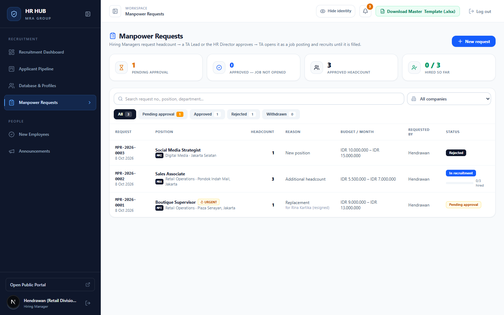
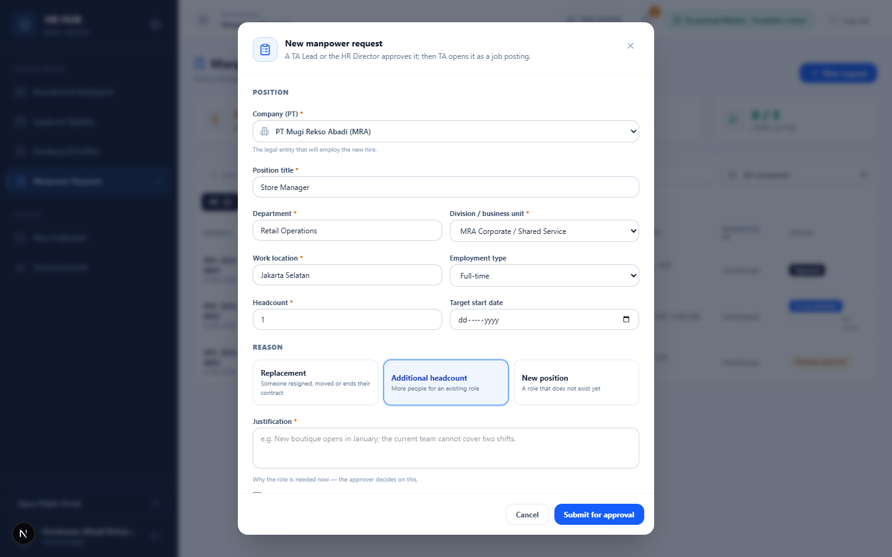
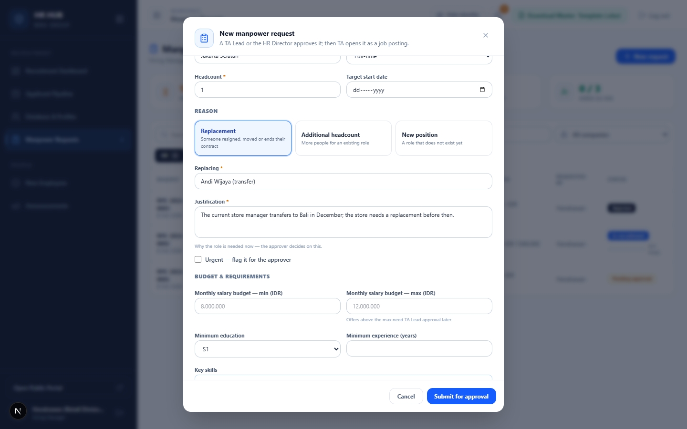
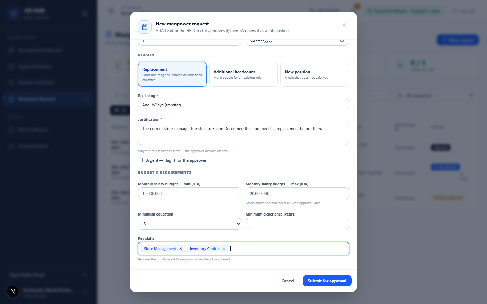
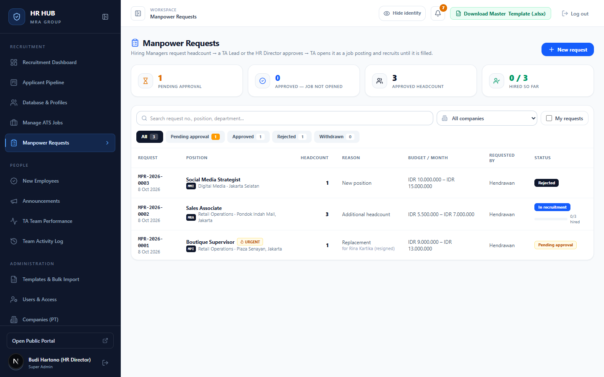
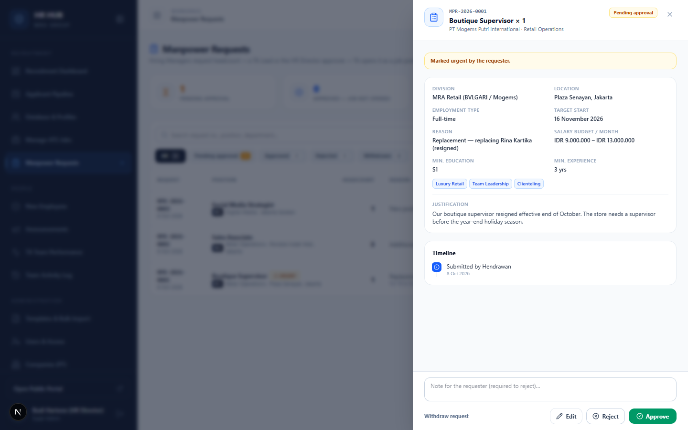
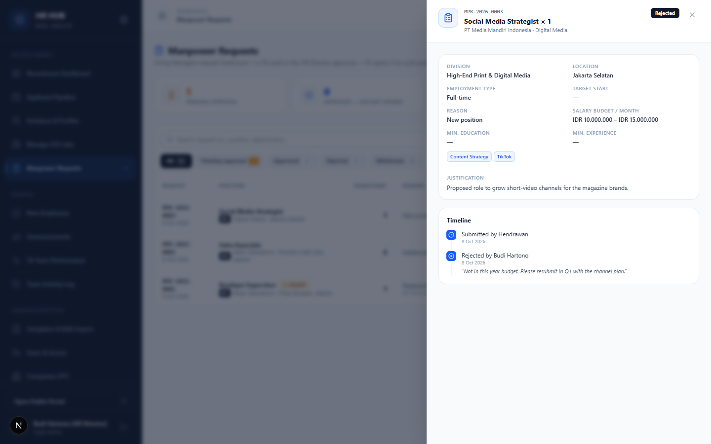
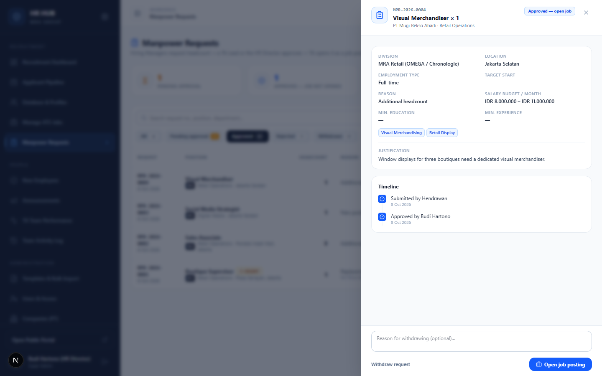
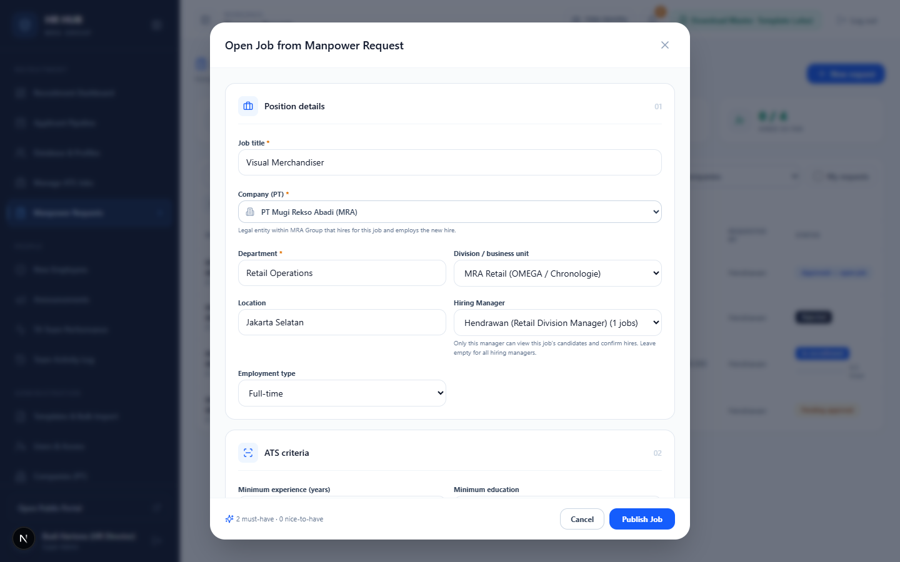
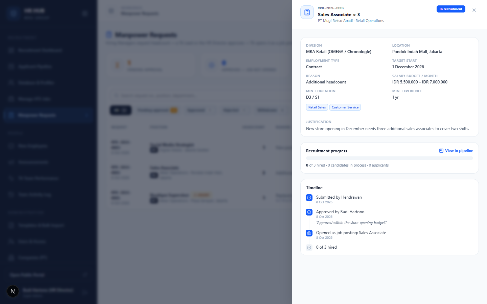

# Panduan Manpower Request (Permintaan Rekrutmen)

**HR HUB · MRA Group** — untuk Hiring Manager, TA Lead, dan HR Director

Manpower Request adalah cara resmi meminta tambahan orang di HR HUB. Kebutuhan diajukan oleh atasan unit, disetujui oleh TA Lead atau HR Director, lalu dibuka oleh tim Talent Acquisition menjadi lowongan. Progres rekrutmennya bisa dipantau sampai kuota terpenuhi.

Menu: **Recruitment → Manpower Requests** (`/admin/manpower`)

---

## Daftar isi

1. [Alur singkat](#1-alur-singkat)
2. [Siapa melakukan apa](#2-siapa-melakukan-apa)
3. [Hiring Manager: mengajukan permintaan](#3-hiring-manager-mengajukan-permintaan)
4. [TA Lead / HR Director: menyetujui atau menolak](#4-ta-lead--hr-director-menyetujui-atau-menolak)
5. [Tim TA: membuka lowongan](#5-tim-ta-membuka-lowongan)
6. [Memantau progres](#6-memantau-progres)
7. [Arti setiap status](#7-arti-setiap-status)
8. [Pengingat di lonceng notifikasi](#8-pengingat-di-lonceng-notifikasi)
9. [Aturan penting & pertanyaan umum](#9-aturan-penting--pertanyaan-umum)

---

## 1. Alur singkat

```
  Hiring Manager           TA Lead / HR Director          Tim TA                    Pipeline
 ┌──────────────┐  kirim  ┌────────────────────┐ setuju ┌──────────────────┐ rekrut ┌─────────────┐
 │  Mengajukan  │ ──────▶ │ Menyetujui/menolak │ ─────▶ │ Membuka lowongan │ ─────▶ │ Hired 3 / 3 │
 └──────────────┘         └────────────────────┘        └──────────────────┘        └─────────────┘
   Pending approval        Approved / Rejected            In recruitment              Fulfilled
```

Setiap permintaan mendapat nomor otomatis, misalnya **MPR-2026-0001**. Gunakan nomor ini saat berkomunikasi dengan tim TA.

---

## 2. Siapa melakukan apa

| Aksi | Hiring Manager | Recruiter (TA) | TA Lead | Super Admin / HR Director |
|---|:-:|:-:|:-:|:-:|
| Melihat permintaan | hanya miliknya | semua | semua | semua |
| Mengajukan permintaan | ✓ | – | ✓ | ✓ |
| Mengubah / menarik permintaan sendiri | ✓ (selama belum diputuskan) | – | ✓ | ✓ |
| Menyetujui / menolak | – | – | ✓ (bukan miliknya sendiri) | ✓ |
| Membuka menjadi lowongan | – | – | ✓ | ✓ |

> Tidak ada yang bisa menyetujui permintaannya sendiri, kecuali Super Admin. Jadi permintaan yang dibuat oleh TA Lead tetap harus disetujui oleh TA Lead lain atau HR Director.

---

## 3. Hiring Manager: mengajukan permintaan

### 3.1 Buka menu dan klik **New request**

Hiring Manager hanya melihat permintaan miliknya sendiri. Empat kartu di atas meringkas status semua permintaan Anda.



### 3.2 Isi bagian *Position*

| Isian | Keterangan |
|---|---|
| **Company (PT)** \* | PT di lingkungan MRA Group yang akan mengontrak karyawan baru. |
| **Position title** \* | Nama jabatan, misalnya *Store Manager*. |
| **Department** \* / **Division** \* | Unit tempat posisi ini berada. |
| **Work location** \* | Lokasi kerja, misalnya *Plaza Senayan, Jakarta*. |
| **Employment type** | Full-time, Contract, Internship, atau Part-time. |
| **Headcount** \* | Jumlah orang yang dibutuhkan (1–50). |
| **Target start date** | Kapan orang baru diharapkan mulai bekerja. |



### 3.3 Pilih alasan dan tulis justifikasi

Pilih salah satu dari tiga alasan:

- **Replacement**: menggantikan karyawan yang resign, mutasi, atau kontraknya selesai. Isian **Replacing** (nama yang digantikan) menjadi wajib.
- **Additional headcount**: menambah orang untuk jabatan yang sudah ada.
- **New position**: jabatan yang belum pernah ada.

Tuliskan **Justification**, yaitu alasan posisi ini dibutuhkan sekarang. Approver memutuskan berdasarkan isian ini, jadi tuliskan dengan jelas dampaknya kalau posisi tidak diisi.

Centang **Urgent** bila memang mendesak. Approver akan melihat tanda *URGENT*, dan pengingatnya muncul berwarna merah.



### 3.4 Isi budget dan syarat, lalu kirim

| Isian | Keterangan |
|---|---|
| **Monthly salary budget (min / max)** | Rentang gaji per bulan dalam Rupiah. Budget ini **tidak tampil** di portal karier publik. Penawaran gaji di atas batas maksimal nanti butuh persetujuan TA Lead. |
| **Minimum education / experience** | Syarat minimal pendidikan dan pengalaman kerja. |
| **Key skills** | Ketik satu skill lalu tekan **Enter**. Skill ini menjadi kata kunci wajib untuk penilaian ATS saat lowongan dibuka. |

Klik **Submit for approval**. Permintaan berstatus *Pending approval* dan approver langsung mendapat pengingat.



> **Salah isi?** Selama status masih *Pending approval*, buka permintaannya dan klik **Edit**, atau **Withdraw request** untuk menarik permintaan.

---

## 4. TA Lead / HR Director: menyetujui atau menolak

### 4.1 Lihat permintaan yang menunggu

Approver melihat permintaan dari semua unit. Tab **Pending approval** berisi permintaan yang menunggu keputusan; angkanya berwarna amber bila ada yang menunggu. Gunakan filter PT, pencarian, atau centang **My requests** untuk melihat permintaan buatan sendiri.



### 4.2 Buka permintaan lalu putuskan

Klik baris permintaan untuk membuka detailnya: posisi, alasan, budget, syarat, skill, dan justifikasi.

- **Approve**: menyetujui. Catatan boleh diisi untuk pengaju.
- **Reject**: menolak. **Catatan wajib diisi** supaya pengaju tahu apa yang harus diperbaiki.
- **Edit**: approver boleh merapikan isian (misalnya budget) sebelum menyetujui.



Contoh permintaan yang ditolak. Catatan penolakan tampil di timeline dan pengaju mendapat pengingat:



---

## 5. Tim TA: membuka lowongan

Permintaan yang disetujui tampil dengan status **Approved — open job**. Buka permintaannya lalu klik **Open job posting**.



Form lowongan terbuka dan **sudah terisi otomatis** dari permintaan:

- judul, PT, departemen, divisi, lokasi, dan tipe kerja;
- rentang gaji dari budget, dengan visibilitas **Confidential** (tidak tampil di portal publik);
- skill sebagai kata kunci ATS wajib;
- pengaju (Hiring Manager) sebagai Hiring Manager lowongan.

Lengkapi deskripsi dan syarat lowongan, lalu klik **Publish Job**. Lowongan langsung tertaut ke permintaannya.



> Satu permintaan hanya bisa menjadi **satu lowongan**. Untuk headcount lebih dari satu, cukup satu lowongan; kuotanya dipantau dari permintaan.

---

## 6. Memantau progres

Setelah lowongan dibuka, detail permintaan menampilkan:

- **Recruitment progress**: berapa orang sudah di-*hire* dari kuota, berapa kandidat sedang diproses, dan jumlah pelamar.
- **View in pipeline**: membuka pipeline yang sudah difilter ke lowongan tersebut.
- **Timeline**: diajukan, disetujui, lowongan dibuka, dan jumlah yang sudah diterima.

Di halaman *Manage ATS Jobs*, detail lowongan juga menampilkan label **From MPR-…**.



---

## 7. Arti setiap status

| Status | Artinya | Langkah berikutnya |
|---|---|---|
| **Pending approval** | Menunggu keputusan TA Lead / HR Director | Approver memutuskan |
| **Approved — open job** | Sudah disetujui, lowongan belum dibuka | Tim TA membuka lowongan |
| **In recruitment** | Lowongan sudah dibuka, rekrutmen berjalan | Proses kandidat di pipeline |
| **Fulfilled** | Jumlah yang di-*hire* sudah sama dengan kuota | Selesai |
| **Rejected** | Ditolak; lihat catatan approver | Ajukan ulang bila perlu |
| **Withdrawn** | Ditarik oleh pengaju atau approver | — |

---

## 8. Pengingat di lonceng notifikasi

| Pengingat | Untuk siapa |
|---|---|
| *n manpower requests awaiting your approval* (merah bila ada yang urgent) | TA Lead, HR Director |
| *n approved manpower requests without a job posting* | Tim TA (TA Lead, Super Admin) |
| *Your manpower request was decided* (selama 3 hari) | Pengaju |

Klik pengingatnya untuk langsung membuka daftar yang relevan.

---

## 9. Aturan penting & pertanyaan umum

**Bisakah saya mengubah permintaan setelah disetujui?**
Tidak. Setelah diputuskan, isian terkunci. Bila kebutuhan berubah, tarik permintaan (selama lowongan belum dibuka) lalu ajukan permintaan baru.

**Bisakah permintaan ditarik setelah disetujui?**
Bisa, selama lowongan belum dibuka. Setelah menjadi lowongan, hubungi tim TA untuk menutup lowongannya.

**Kenapa budget gaji tidak muncul di portal karier?**
Budget adalah informasi internal. Lowongan dari Manpower Request otomatis dibuat dengan gaji *Confidential*. Tim TA bisa mengubahnya di form lowongan bila memang ingin ditampilkan.

**Bagaimana menulis budget?**
Ketik angkanya saja (misalnya `9000000`); tampilan otomatis menjadi `9.000.000`.

**Saya Hiring Manager, kenapa tidak bisa melihat permintaan unit lain?**
Hiring Manager hanya melihat permintaan miliknya sendiri. Tim TA dan approver melihat semuanya.

**Siapa yang harus dihubungi bila ada kendala?**
Tim Talent Acquisition atau IT Shared Service MRA Group.
