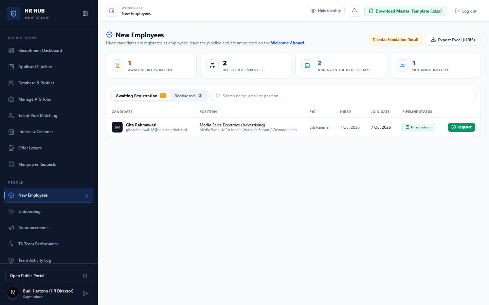
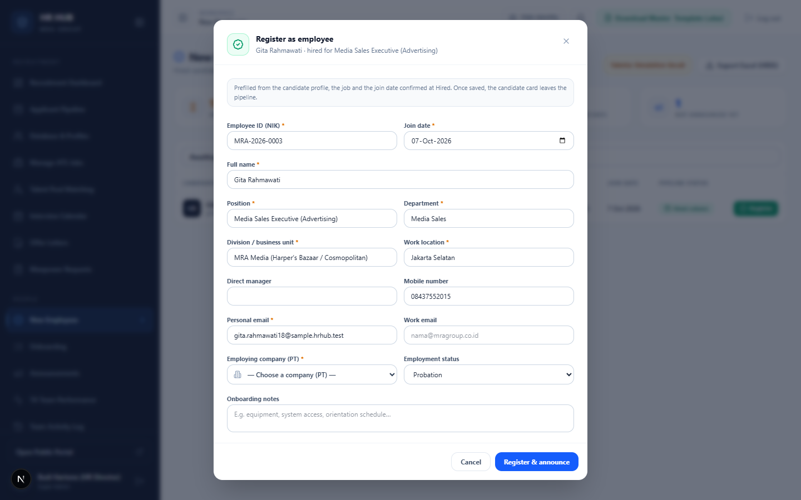
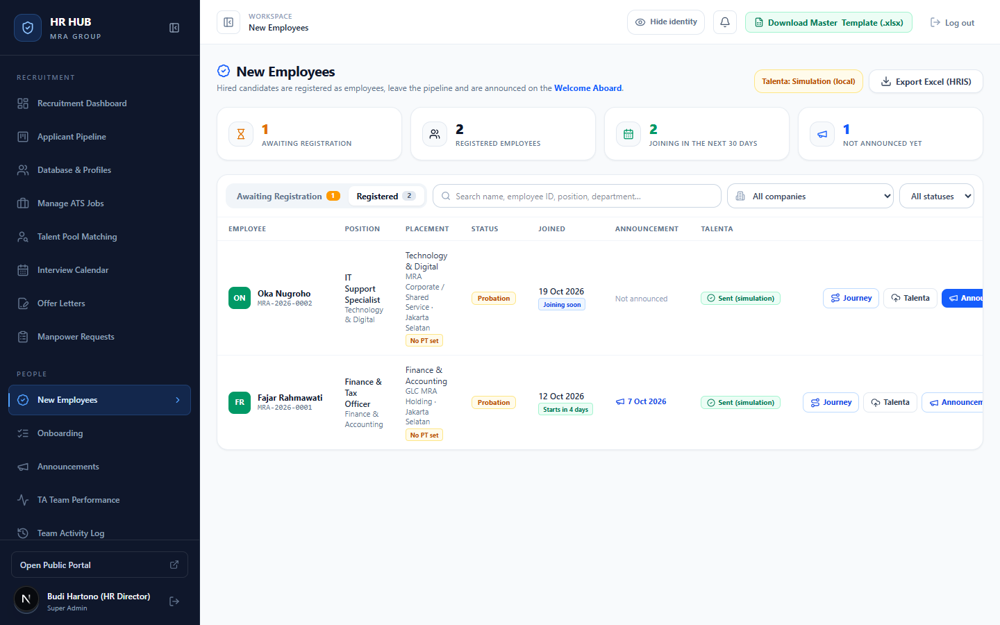
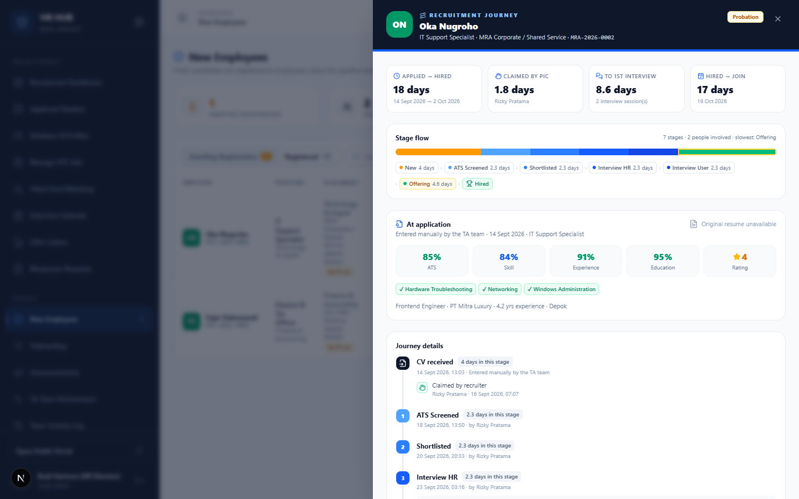
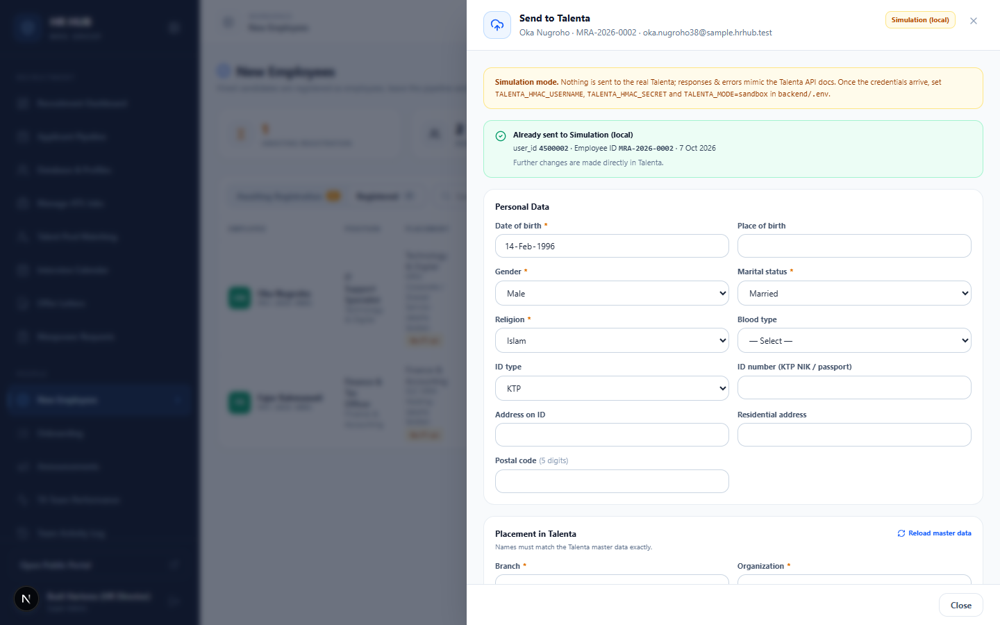

# Panduan New Employees (Karyawan Baru)

**HR HUB · MRA Group** — untuk Recruiter (TA), TA Lead, HR Director · Hiring Manager dapat melihat karyawan untuk lowongannya

Setelah kandidat diterima (*Hired*), langkah berikutnya ada di menu ini: daftarkan kandidat sebagai karyawan, umumkan di papan *Welcome Aboard*, lalu kirim datanya ke Talenta (HRIS). Data karyawan disimpan terpisah dari data kandidat, jadi tetap aman meskipun kandidat atau lowongannya dihapus.

Menu: **People → New Employees** (`/admin/employees`)

---

## Daftar isi

1. [Alur singkat](#1-alur-singkat)
2. [Halaman utama](#2-halaman-utama)
3. [Mendaftarkan karyawan](#3-mendaftarkan-karyawan)
4. [Karyawan terdaftar & pengumuman](#4-karyawan-terdaftar--pengumuman)
5. [Recruitment Journey](#5-recruitment-journey)
6. [Mengirim ke Talenta](#6-mengirim-ke-talenta)
7. [Pertanyaan umum](#7-pertanyaan-umum)

---

## 1. Alur singkat

```
 Pipeline: Hired ──▶ Register ──▶ Announce ──▶ Talenta (HRIS) ──▶ Onboarding checklist
                       │             (Welcome     (data payroll,      (otomatis dibuat
                       │              Aboard)      BPJS, bank)         saat Register)
                       └─ kartu keluar dari pipeline
```

---

## 2. Halaman utama



- **Kartu ringkasan**:
  - *Awaiting registration*: sudah Hired tapi belum didaftarkan.
  - *Registered employees*.
  - *Joining in the next 30 days*.
  - *Not announced yet*.
- **Talenta: …** (kanan atas): mode koneksi Talenta. *Simulation (local)* berarti belum tersambung ke Talenta yang sebenarnya.
- **Export Excel (HRIS)**: mengunduh daftar karyawan sesuai filter.
- Tab **Awaiting Registration** dan **Registered**, dengan pencarian, filter PT, dan filter status kerja.

---

## 3. Mendaftarkan karyawan

Di tab **Awaiting Registration**, klik **Register** pada kandidat. Tombol yang sama juga ada di kartu Hired di Pipeline.



Form sudah terisi dari profil kandidat, lowongan, dan tanggal bergabung yang dikonfirmasi saat *Hired*. Periksa dan lengkapi:

| Isian | Keterangan |
|---|---|
| **Employee ID (NIK)** \* | Disarankan otomatis, misalnya `MRA-2026-0003`. Harus unik. |
| **Join date** \* | Tanggal mulai bekerja. |
| **Full name**, **Position**, **Department**, **Division**, **Work location** \* | Data penempatan. |
| **Direct manager**, **Mobile number**, **Work email** | Opsional. |
| **Personal email** \* | Email pribadi karyawan. |
| **Employing company (PT)** \* | PT yang mengontrak. Default dari PT lowongan. |
| **Employment status** | Probation, Contract, atau Permanent. |
| **Onboarding notes** | Misalnya perangkat, akses sistem, jadwal orientasi. |

Klik **Register & announce**. Setelah itu:
- Kartu kandidat keluar dari Pipeline (tetap dihitung sebagai *Hired* di laporan).
- Checklist **Onboarding** dibuat otomatis ([panduan Onboarding](../onboarding/README.md)).

> Kandidat yang diterima tapi tidak jadi didaftarkan bisa dikeluarkan dari pipeline dengan **Release** di kartu Hired, lalu dikembalikan dari menu ini jika perlu.

---

## 4. Karyawan terdaftar & pengumuman



Setiap baris menampilkan:
- Posisi, penempatan, dan PT. Label oranye **No PT set** berarti PT belum diisi.
- Status kerja dan tanggal bergabung.
- Status pengumuman dan status Talenta.

Tombol di setiap baris:
- **Journey**: perjalanan rekrutmen karyawan ini (bagian 5).
- **Talenta**: data HRIS dan pengiriman ke Talenta (bagian 6).
- **Announce**: mengumumkan karyawan di papan **Welcome Aboard** (menu *Announcements* dan widget di dashboard). Pengumuman tidak menampilkan kontak pribadi.

Klik ikon ✏️ (pensil) di ujung baris untuk mengubah data karyawan. Nama karyawan juga bisa diklik untuk membuka Journey.

---

## 5. Recruitment Journey

Klik **Journey** untuk melihat perjalanan kandidat dari CV masuk sampai diterima.



- **Metrik utama**: *Applied → Hired* (total hari), *Claimed by PIC* (kecepatan diambil Recruiter), *To 1st interview*, *Hired → Join*.
- **Stage flow**: lama di setiap tahap, jumlah orang yang terlibat, dan tahap paling lambat.
- **At application**: skor ATS, rincian skor, rating, dan kata kunci yang cocok saat melamar.
- **Journey details**: kronologi lengkap setiap tahap (siapa memindahkan, kapan, jadwal interview, gaji, persetujuan), lalu aksi setelah hire.

Cocok untuk evaluasi proses rekrutmen atau untuk dibagikan ke Hiring Manager.

---

## 6. Mengirim ke Talenta

Tombol **Talenta** tersedia untuk TA Lead dan Super Admin.



1. Lengkapi data yang dibutuhkan Talenta:
   - **Personal data**: tanggal dan tempat lahir, jenis kelamin, status pernikahan, agama, KTP, alamat.
   - **Placement in Talenta**: branch, organization, job position, dan job level. Pilihannya diambil langsung dari master data Talenta, jadi namanya harus sama persis.
   - **Payroll & tax**: gaji (default dari tahap Offering), NPWP, status PTKP.
   - **BPJS** dan **bank**.
2. Klik **Save draft** untuk menyimpan sementara, lalu **Send to Talenta** untuk mengirim (dalam mode simulasi tombolnya bernama *Send (simulation)*).
3. Jika Talenta menolak (misalnya email atau Employee ID sudah ada), pesan kesalahannya tampil di form. Perbaiki lalu kirim lagi.

> Data sensitif (gaji, KTP, NPWP, rekening) hanya terlihat di form ini. Setelah berhasil terkirim, perubahan berikutnya dilakukan langsung di Talenta.
>
> **Mode Simulation (local)**: saat ini HR HUB belum tersambung ke Talenta yang sebenarnya. Pengiriman disimulasikan, dan karyawan bisa dikirim ulang setelah koneksi Talenta aktif.

---

## 7. Pertanyaan umum

**Kandidat Hired tidak muncul di Awaiting Registration.**
Mungkin kandidat sudah di-*Release* dari pipeline, atau Anda Recruiter dan kandidat itu bukan milik Anda. Recruiter hanya bisa mendaftarkan kandidat miliknya, sedangkan TA Lead bisa mendaftarkan semua.

**Apa bedanya Register dan Release?**
*Register* membuat data karyawan, checklist onboarding, dan bisa diumumkan. *Release* hanya mengeluarkan kartu dari pipeline tanpa membuat data karyawan.

**Bisakah PT karyawan berbeda dengan PT lowongan?**
Bisa. PT karyawan mengikuti lowongan saat didaftarkan, tapi bisa diubah di form.
