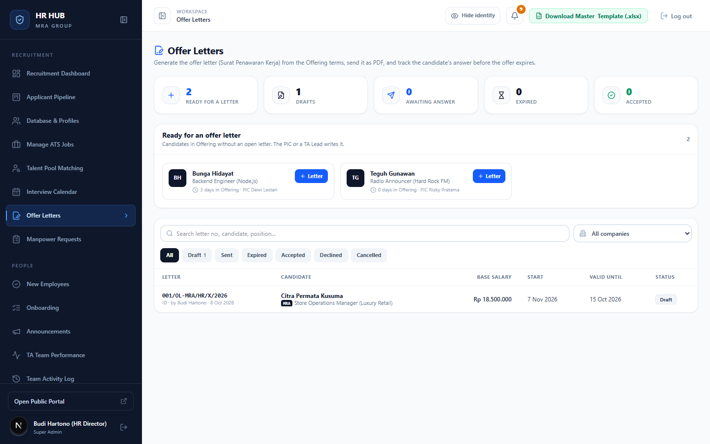
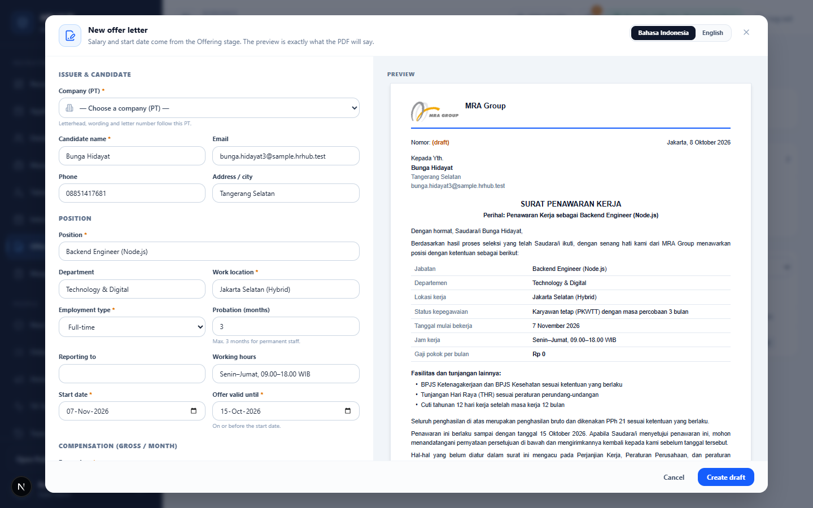
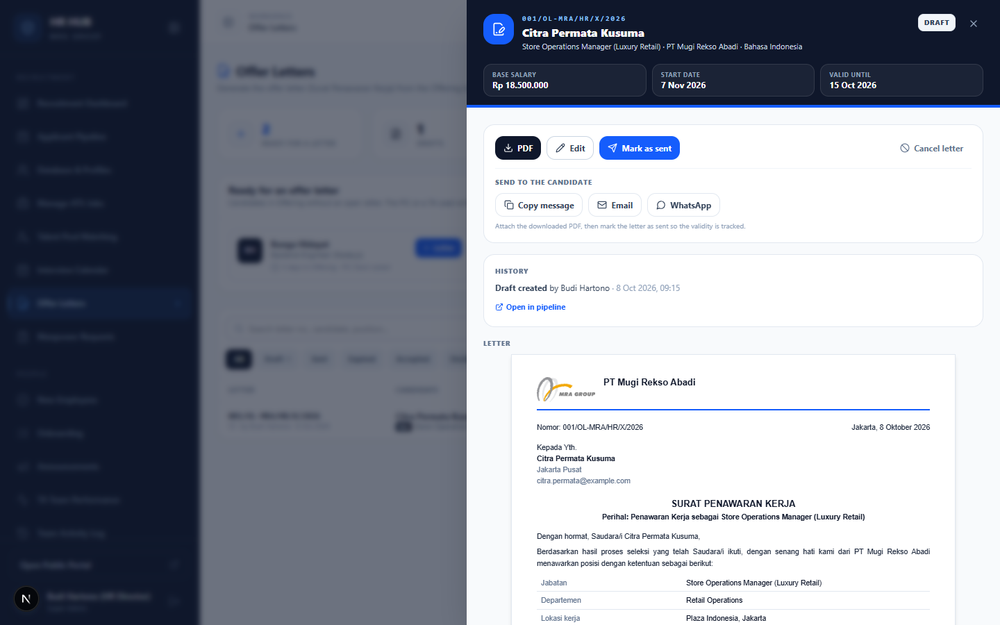
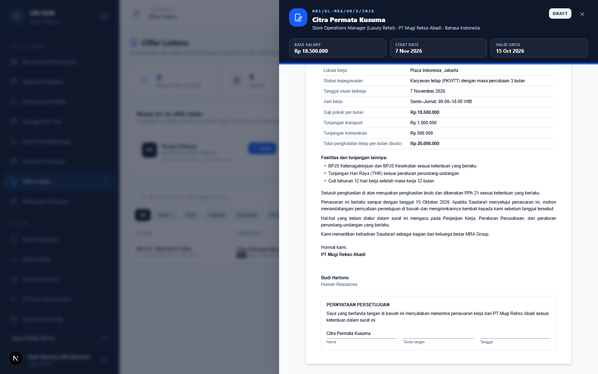

# Panduan Offer Letters (Surat Penawaran Kerja)

**HR HUB · MRA Group** — untuk Recruiter (TA), TA Lead, dan HR Director · Hiring Manager dapat melihat dan mengunduh

Menu ini membuat surat penawaran kerja dalam bentuk PDF, berisi kop PT, nomor surat otomatis, dan pernyataan persetujuan. Gaji dan tanggal mulai diambil langsung dari isian tahap *Offering* di pipeline. Setelah surat dikirim, HR HUB memantau masa berlakunya sampai kandidat menjawab.

Menu: **Recruitment → Offer Letters** (`/admin/offers`)

---

## Daftar isi

1. [Alur singkat](#1-alur-singkat)
2. [Halaman utama](#2-halaman-utama)
3. [Membuat surat](#3-membuat-surat)
4. [Mengirim surat ke kandidat](#4-mengirim-surat-ke-kandidat)
5. [Mencatat jawaban kandidat](#5-mencatat-jawaban-kandidat)
6. [Arti setiap status](#6-arti-setiap-status)
7. [Aturan penting & pertanyaan umum](#7-aturan-penting--pertanyaan-umum)

---

## 1. Alur singkat

```
 Pipeline: Offering ──▶ Draft ──▶ Sent ──▶ Accepted ──▶ Pipeline: Hired
   (gaji, tgl mulai)   (PDF)    (dipantau     │             (signed offer + join date,
                                 masa berlaku)└─▶ Declined    konfirmasi Hiring Manager)
```

Hanya **PIC kandidat** atau **TA Lead** yang dapat membuat, mengubah, mengirim, dan mencatat jawaban surat.

---

## 2. Halaman utama



- **Kartu ringkasan**: *Ready for a letter*, *Drafts*, *Awaiting answer*, *Expired*, *Accepted*. Klik kartu untuk memfilter daftar.
- **Ready for an offer letter**: kandidat di tahap *Offering* yang belum punya surat aktif, beserta lama di Offering dan PIC-nya. Tombol **+ Letter** hanya muncul jika Anda boleh membuat suratnya.
- **Daftar surat**: cari berdasarkan nomor surat, kandidat, atau posisi. Filter per PT dan per status. Klik baris untuk membuka detail surat.

---

## 3. Membuat surat

Klik **+ Letter** pada kandidat. Form terbuka dengan data yang sudah terisi, dan **preview** di kanan menampilkan isi surat persis seperti PDF-nya.



| Bagian | Isian | Terisi otomatis dari |
|---|---|---|
| Bahasa | **Bahasa Indonesia** / **English** (tombol kanan atas) | Bahasa Indonesia |
| Issuer & candidate | **Company (PT)** \*: menentukan kop, isi surat, dan nomor surat. Nama, email, HP, dan alamat kandidat. | PT lowongan, profil kandidat |
| Position | Jabatan, departemen, lokasi, tipe kerja, masa percobaan (Full-time, maks. 3 bulan) atau lama kontrak (Contract), atasan langsung, jam kerja | Lowongan, Hiring Manager |
| Tanggal | **Start date** \* dan **Offer valid until** \* (paling lambat sama dengan tanggal mulai) | Tahap Offering, hari ini + 7 hari |
| Compensation | **Base salary** \* (bruto per bulan), tunjangan tetap (bisa beberapa, totalnya dihitung otomatis), fasilitas lain, ketentuan tambahan (satu per baris) | Gaji dari tahap Offering, fasilitas standar (BPJS, THR, cuti) |
| Signatory | Nama dan jabatan penandatangan | Pembuat surat |

Saat bahasa diganti, teks standar (fasilitas dan jam kerja) ikut berganti, selama belum Anda ubah sendiri.

Klik **Create draft**. Surat mendapat nomor otomatis, misalnya **001/OL-MRA/HR/X/2026** (urut per PT per tahun, bulan dalam angka Romawi).

---

## 4. Mengirim surat ke kandidat

Detail surat terbuka setelah draft dibuat.



**Cara tercepat:** klik **Email to candidate**. HR HUB mengirim email berisi surat (PDF terlampir) ke email kandidat dan otomatis menandai surat sebagai *Sent*. Selama menunggu jawaban, tombol berubah menjadi **Resend email**. Balasan kandidat masuk ke email Anda (Reply-To).

Atau kirim sendiri:

1. Klik **PDF** untuk membuka dan mengunduh surat.
2. Kirim ke kandidat lewat salah satu cara di bagian *Send to the candidate*:
   - **Copy message**: menyalin pesan pengantar (Bahasa Indonesia atau English, sesuai bahasa surat).
   - **Email**: membuka aplikasi email dengan subjek dan pesan terisi. Lampirkan PDF-nya.
   - **WhatsApp**: membuka WhatsApp kandidat dengan pesan terisi. Kirim PDF-nya di chat yang sama.
3. Klik **Mark as sent**. Mulai saat itu masa berlaku dipantau, dan surat tidak bisa diubah lagi.

Selama masih *Draft*, surat bisa diperbaiki dengan **Edit**.



PDF berisi: kop PT (logo, nama, alamat, NPWP), nomor dan tanggal surat, ketentuan kerja, rincian gaji dan tunjangan beserta totalnya, fasilitas, catatan pajak (PPh 21), masa berlaku, tanda tangan, serta kotak **Pernyataan Persetujuan** untuk ditandatangani kandidat.

> Alamat dan NPWP di kop diambil dari menu **Companies (PT)**. Pastikan datanya sudah diisi.

---

## 5. Mencatat jawaban kandidat

Setelah kandidat menjawab, buka detail surat:

- **Accepted**: catatan boleh diisi (misalnya "surat bertanda tangan diterima via email").
- **Declined**: **alasan wajib diisi** (misalnya menerima tawaran lain, atau ekspektasi gaji).
- **Cancel letter**: menarik surat yang masih draft atau sudah dikirim. Gunakan ini jika ketentuannya berubah, lalu buat surat baru.

> **Penting:** status *Accepted* **tidak** otomatis memindahkan kandidat ke *Hired*. Pindahkan kandidat ke **Hired** di Pipeline (isi offer ditandatangani dan tanggal bergabung). Setelah itu Hiring Manager mengonfirmasinya.

---

## 6. Arti setiap status

| Status | Arti |
|---|---|
| **Draft** | Surat dibuat, belum dikirim. Masih bisa diubah. |
| **Sent** | Sudah dikirim, menunggu jawaban. Daftar menampilkan sisa hari berlakunya. |
| **Expired** | Sudah dikirim tapi melewati tanggal *valid until* tanpa jawaban. Jawaban masih bisa dicatat, atau surat bisa dibatalkan. |
| **Accepted** | Kandidat menerima. |
| **Declined** | Kandidat menolak (alasan tercatat). |
| **Cancelled** | Surat ditarik. |

---

## 7. Aturan penting & pertanyaan umum

- Satu lamaran hanya punya **satu surat aktif** (Draft, Sent, atau Accepted). Untuk membuat surat baru, batalkan dulu surat yang lama.
- Semua aksi tercatat di riwayat kandidat dan di **Team Activity Log** (filter *Offer letters*).
- Pengingat di lonceng: kandidat Offering yang belum punya surat, surat yang habis dalam 2 hari, dan surat yang sudah *Expired* tanpa jawaban.

**Gaji di surat berbeda dengan yang disetujui.**
Surat mengambil gaji dari isian tahap Offering terakhir, tapi Anda bisa mengubahnya selama surat masih draft. Jika gaji naik di atas budget lowongan, ajukan persetujuan lewat Pipeline terlebih dahulu.

**Hiring Manager bisa membuat surat?**
Tidak. Hiring Manager hanya bisa melihat dan mengunduh surat untuk lowongannya.
