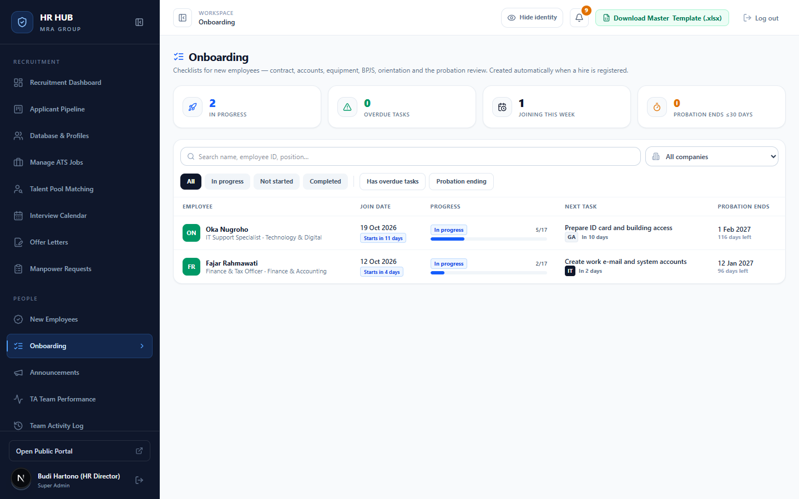
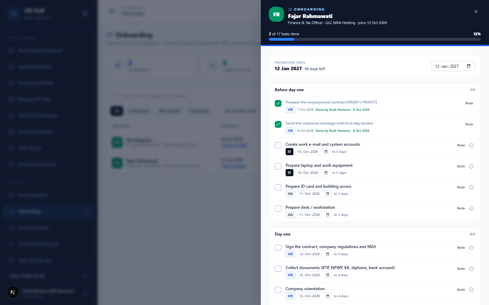
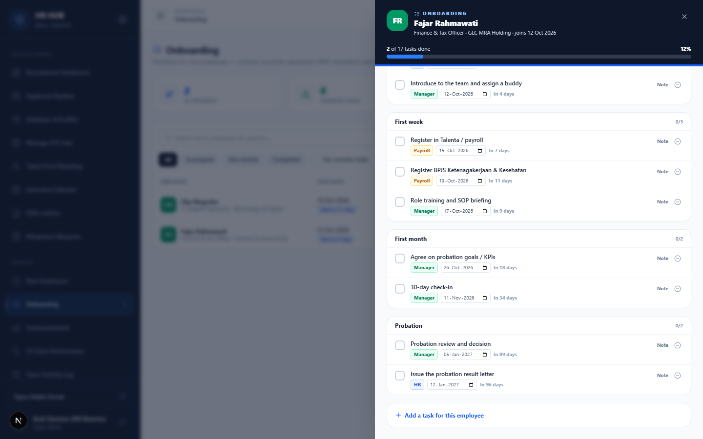

# Panduan Onboarding

**HR HUB · MRA Group** — untuk HR, Talent Acquisition, dan Hiring Manager (atasan langsung)

Setiap karyawan baru otomatis mendapat checklist onboarding saat didaftarkan di menu *New Employees*. Isinya mulai dari kontrak dan akun kerja, laptop dan ID card, BPJS, orientasi, sampai review masa percobaan. Setiap tugas punya tim penanggung jawab dan tenggat yang dihitung dari tanggal bergabung.

Menu: **People → Onboarding** (`/admin/onboarding`)

---

## Daftar isi

1. [Daftar karyawan dalam onboarding](#1-daftar-karyawan-dalam-onboarding)
2. [Checklist per karyawan](#2-checklist-per-karyawan)
3. [Mengerjakan tugas](#3-mengerjakan-tugas)
4. [Masa percobaan](#4-masa-percobaan)
5. [Siapa melakukan apa](#5-siapa-melakukan-apa)
6. [Pertanyaan umum](#6-pertanyaan-umum)

---

## 1. Daftar karyawan dalam onboarding

- **Kartu ringkasan** (klik untuk memfilter): *In progress*, *Overdue tasks* (tugas lewat tenggat), *Joining this week*, *Probation ends ≤30 days*.
- **Filter**: pencarian, PT, tab status (*All / In progress / Not started / Completed*), plus **Has overdue tasks** dan **Probation ending**.

Kolom tabel:

| Kolom | Isi |
|---|---|
| **Employee** | Nama, PT, posisi, dan departemen. |
| **Join date** | Tanggal bergabung. Label biru *Starts in n days* untuk 14 hari ke depan. |
| **Progress** | Tugas selesai dari total, jumlah yang terlambat, dan progress bar (hijau = selesai, oranye = ada yang terlambat). |
| **Next task** | Tugas berikutnya, tim penanggung jawab, dan tenggatnya. |
| **Probation ends** | Akhir masa percobaan dan sisa harinya. |

---

## 2. Checklist per karyawan

Klik baris karyawan untuk membuka checklist-nya.

Tugas dikelompokkan per fase: **Before day one → Day one → First week → First month → Probation**.

Setiap tugas menampilkan tim penanggung jawabnya:

| Tim | Contoh tugas |
|---|---|
| **HR** | Kontrak kerja (PKWT/PKWTT), pesan selamat datang, tanda tangan kontrak dan NDA, pengumpulan dokumen, orientasi |
| **IT** | E-mail kerja dan akun sistem, laptop dan perangkat |
| **GA** | ID card dan akses gedung, meja kerja |
| **Payroll** | Registrasi Talenta/payroll, BPJS Ketenagakerjaan & Kesehatan |
| **Manager** | Perkenalan tim dan buddy, training peran, target masa percobaan, check-in 30 hari, review masa percobaan |

Tenggat dihitung otomatis dari tanggal bergabung. Contohnya, kontrak disiapkan 5 hari sebelumnya dan BPJS paling lambat 1 minggu setelahnya.

---

## 3. Mengerjakan tugas

- **Centang** kotak di kiri tugas untuk menandainya selesai. Tercatat siapa yang menyelesaikan dan kapan. Klik lagi untuk membatalkan.
- **Note**: menambahkan catatan, misalnya nomor aset laptop atau nomor BPJS.
- **Tanggal**: ubah tenggat jika jadwalnya bergeser.
- **⊖ Skip**: lewati tugas yang tidak relevan untuk karyawan ini. Tugas yang dilewati tidak dihitung dalam progres.
- **Add a task for this employee**: tambahkan tugas khusus (misalnya fitting seragam butik), lengkap dengan tim, fase, dan tenggat.

Progres di bagian atas (*n of 17 tasks done*) dan di daftar ikut diperbarui.

> Karyawan yang didaftarkan sebelum fitur ini ada akan berstatus *Not started*. Buka checklist-nya lalu klik **Start onboarding**.

---

## 4. Masa percobaan

- Untuk karyawan berstatus **Probation**, akhir masa percobaan otomatis diisi **3 bulan setelah tanggal bergabung**. Tanggalnya bisa diubah di bagian *Probation ends* pada checklist.
- Tugas fase *Probation* (review dan keputusan, surat hasil percobaan) ikut bergeser saat tanggal itu diubah.
- Fase *Probation* hanya ada untuk karyawan berstatus Probation.
- Lonceng mengingatkan jika masa percobaan berakhir dalam 14 hari.

---

## 5. Siapa melakukan apa

| Aksi | HR & Talent Acquisition | Hiring Manager |
|---|:-:|:-:|
| Melihat checklist | semua karyawan | karyawan untuk lowongannya |
| Mencentang / memberi catatan | semua tugas | **hanya tugas tim Manager** |
| Mengubah tenggat, skip, tambah/hapus tugas | ✓ | – |
| Mengubah akhir masa percobaan | ✓ | – |

---

## 6. Pertanyaan umum

**Tim IT/GA tidak punya akun HR HUB. Bagaimana tugas mereka dicentang?**
HR mencentangnya setelah tim terkait mengonfirmasi, lalu menambahkan catatan (misalnya nomor aset atau tanggal serah terima).

**Bisakah daftar tugas standar diubah?**
Bisa, oleh tim IT HR HUB (satu file konfigurasi). Untuk kebutuhan satu karyawan saja, gunakan **Add a task**.

**Ada pengingat?**
Ya. Lonceng menampilkan tugas onboarding yang terlambat (untuk Hiring Manager, hanya tugas tim Manager) dan masa percobaan yang berakhir dalam 14 hari.
