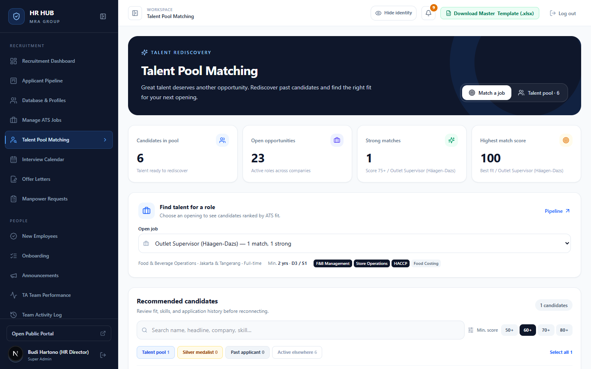
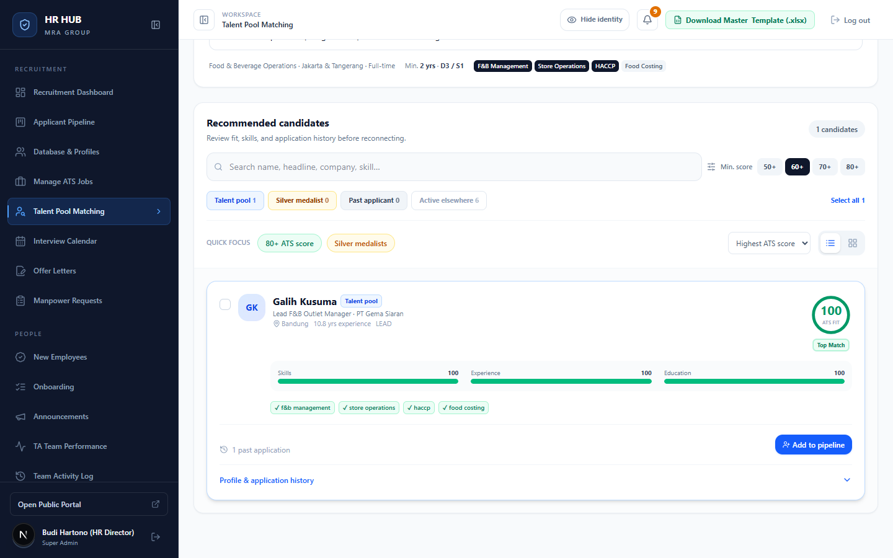
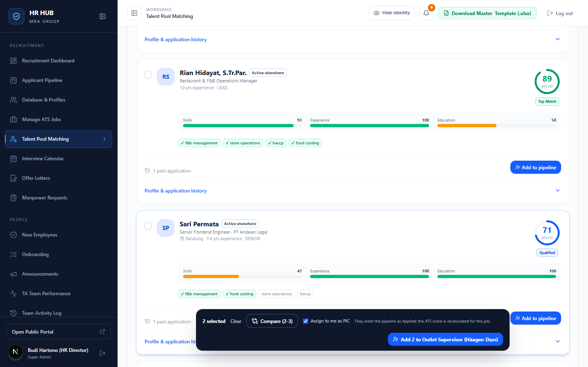
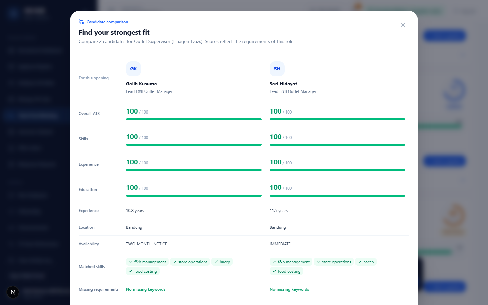
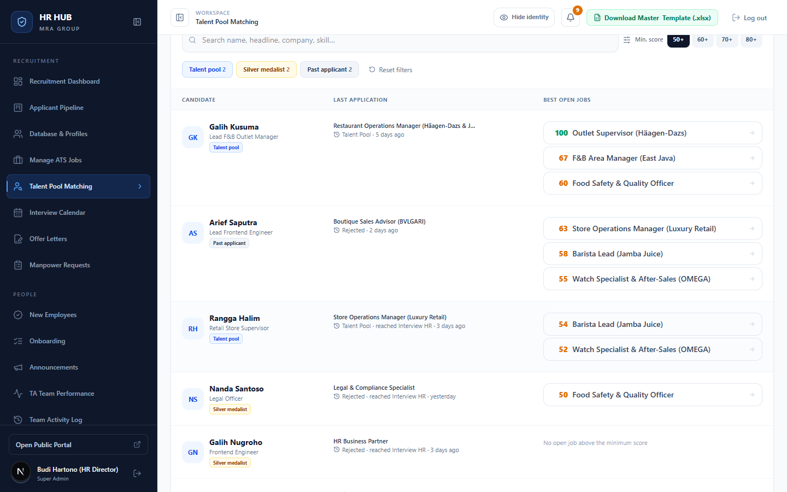

# Panduan Talent Pool Matching

**HR HUB · MRA Group** — untuk Recruiter (TA), TA Lead, dan HR Director

Saat lowongan baru dibuka, kandidat terbaik sering kali sudah ada di database: orang yang dulu diparkir di *Talent Pool*, atau yang gagal di tahap akhir untuk posisi lain. Talent Pool Matching menilai ulang kandidat lama terhadap lowongan yang sedang buka, memakai mesin ATS yang sama dengan pelamar baru. Kandidat yang cocok bisa langsung dimasukkan ke pipeline.

Menu: **Recruitment → Talent Pool Matching** (`/admin/talent-pool`) · hanya untuk tim TA (Hiring Manager tidak memiliki akses).

---

## Daftar isi

1. [Kategori kandidat](#1-kategori-kandidat)
2. [Mencari kandidat untuk satu lowongan](#2-mencari-kandidat-untuk-satu-lowongan)
3. [Membaca kartu kandidat](#3-membaca-kartu-kandidat)
4. [Membandingkan & memasukkan ke pipeline](#4-membandingkan--memasukkan-ke-pipeline)
5. [Tab Talent pool: lowongan terbaik per kandidat](#5-tab-talent-pool-lowongan-terbaik-per-kandidat)
6. [Pertanyaan umum](#6-pertanyaan-umum)

---

## 1. Kategori kandidat

| Kategori | Artinya | Ditampilkan |
|---|---|---|
| **Talent pool** | Diparkir di kolom *Talent Pool* lowongan lain. | default |
| **Silver medalist** | Ditolak untuk posisi lain **setelah sampai tahap interview** atau lebih. | default |
| **Past applicant** | Ditolak di tahap awal untuk posisi lain. | default |
| **Active elsewhere** | Masih aktif di pipeline lowongan lain. Koordinasikan dengan PIC-nya. | jika dinyalakan |

Tidak pernah ditampilkan: kandidat yang **sudah melamar lowongan ini**, dan kandidat yang **sudah menjadi karyawan**.

---

## 2. Mencari kandidat untuk satu lowongan

1. Tab **Match a job** terbuka secara default. Empat kartu di atas: jumlah kandidat di pool, lowongan buka, jumlah *strong match* (skor ≥75), dan skor tertinggi.
2. Pilih lowongan di **Open job**. Setiap pilihan menampilkan jumlah kandidat yang cocok. Di bawahnya tampil kriteria lowongan (minimal pengalaman, pendidikan, kata kunci must-have berwarna gelap, nice-to-have berwarna terang).
3. Atur filter di daftar *Recommended candidates*:
   - **Min. score**: 50+, 60+ (default), 70+, atau 80+.
   - **Kategori**: klik untuk menyalakan atau mematikan (angka = jumlah kandidat di atas skor minimum).
   - **Quick focus**: *80+ ATS score* atau *Silver medalists*.
   - **Urutan** dan tampilan **daftar / grid**.

> Dari menu **Manage ATS Jobs**, tombol *Find in talent pool* di detail lowongan langsung membuka halaman ini untuk lowongan tersebut.

---

## 3. Membaca kartu kandidat

Setiap kartu kandidat menampilkan:
- **Lingkaran skor**: skor ATS untuk lowongan ini (hijau *Top Match* ≥85, biru *Qualified* ≥70, oranye *Needs Review*).
- **Skills / Experience / Education**: rincian skornya.
- **Kata kunci**: ✓ hijau ditemukan di profil, garis putus-putus berarti must-have yang belum ada.
- **Riwayat lamaran**: buka *Profile & application history* untuk melihat lowongan sebelumnya, tahap terjauh yang dicapai, dan kapan.
- **Peringatan "Rejected n days ago"** (kuning): kandidat ditolak kurang dari 90 hari lalu. Cek alasannya dulu sebelum menghubungi lagi.

Skor dihitung langsung dari profil yang tersimpan, jadi selalu mengikuti kriteria lowongan yang terbaru.

---

## 4. Membandingkan & memasukkan ke pipeline

Centang kotak di kiri kartu untuk memilih kandidat. Bilah aksi muncul di bawah layar.

- **Compare (2–3)**: membandingkan 2–3 kandidat berdampingan (skor, pengalaman, lokasi, ketersediaan, kata kunci yang cocok dan yang kurang).

- **Assign to me as PIC** (default menyala): kandidat langsung menjadi milik Anda. Matikan jika ingin memasukkannya ke antrean *Unassigned*.
- **Add n to …** atau **Add to pipeline** di satu kartu: kandidat masuk ke pipeline lowongan ini di tahap **New (Applied)**, dengan skor ATS yang dihitung ulang untuk lowongan ini.

Setelah berhasil, muncul banner hijau dengan tautan **Open in pipeline**. Kandidat yang sudah ditambahkan tidak muncul lagi di daftar untuk lowongan ini. Aksi ini tercatat di Activity Log sebagai *Added from the talent pool*.

> Maksimal 50 kandidat sekali tambah. Lowongan yang sudah ditutup tidak bisa ditambah kandidat.

---

## 5. Tab Talent pool: lowongan terbaik per kandidat

Tab **Talent pool** membalik sudut pandangnya: semua kandidat di pool beserta **3 lowongan buka yang paling cocok** untuk masing-masing.

- Kolom *Last application* menunjukkan lamaran terakhir dan sejauh mana prosesnya.
- Klik salah satu lowongan di kolom *Best open jobs* untuk pindah ke tab *Match a job* dengan lowongan itu terpilih.

---

## 6. Pertanyaan umum

**Kenapa lowongan saya "no matches"?**
Tidak ada kandidat pool dengan skor di atas minimum. Turunkan ke 50+, nyalakan *Active elsewhere*, atau periksa kata kunci must-have lowongan (mungkin terlalu spesifik).

**Bagaimana kandidat bisa masuk ke Talent Pool?**
Pindahkan kartunya ke kolom *Talent Pool* di Applicant Pipeline. Gunakan ini untuk kandidat bagus yang belum cocok dengan posisi saat ini.

**Apakah kandidat diberi tahu saat ditambahkan?**
Tidak. Kandidat hanya masuk ke pipeline internal. Tim TA yang menghubunginya.

**Ada pengingat otomatis?**
Ya. Lonceng memberi tahu jika lowongan yang dibuka dalam 14 hari terakhir punya kandidat *Talent pool* atau *Silver medalist* dengan skor 80+.
